# Cross-Site Request Forgery (CSRF)

## Vuk Vićentić SV45/2022

## Analiza odbrane

### 1. Objašnjenje klase napada

**Cross-Site Request Forgery (CSRF)** je napad u kome napadač navede žrtvin browser da pošalje neželjeni HTTP zahtev ka aplikaciji u kojoj je žrtva ulogovana. Aplikacija ne može da razlikuje legitiman zahtev koji je korisnik namerno poslao od zahteva koji je "podmetnut" sa zlonamernog sajta — jer browser automatski prilaže sve relevantne cookie-je (uključujući sesijski cookie) uz svaki zahtev ka tom domenu.

Napad funkcioniše po principu **"confused deputy"** — browser je posrednik koji ima ovlašćenje (žrtvinu sesiju) i napadač ga zloupotrebljava da izvrši akciju u svoje ime. Žrtva samo treba da poseti napadačevu stranicu dok je ulogovana u ciljnu aplikaciju.

Da bi CSRF napad bio moguć, moraju biti ispunjena tri uslova:

1. **Postoji relevantna akcija** koju napadač želi da izvrši (promena email-a, lozinke, transfer novca, brisanje naloga)
2. **Aplikacija se oslanja samo na cookie-je** za identifikaciju sesije — nema dodatne provere porekla zahteva
3. **Svi parametri zahteva su predvidivi** — napadač može unapred da konstruiše ceo zahtev

### 2. Uticaj iskorištenja (impact)

- **Preuzimanje naloga (account takeover)** — ako napadač može da promeni email adresu ili lozinku žrtve, dobija potpunu kontrolu nad nalogom
- **Neovlašćene finansijske transakcije** — transfer novca, kupovine, promena podataka za naplatu
- **Promena bezbednosnih podešavanja** — isključivanje 2FA, promena security pitanja, dodavanje napadačevog email-a kao recovery adrese
- **Manipulacija podacima** — kreiranje, izmena ili brisanje sadržaja u ime žrtve
- **Eskalacija privilegija** — ako je žrtva administrator, CSRF može da kreira nove admin naloge ili promeni dozvole
- **Reputational damage** — objavljivanje sadržaja, slanje poruka ili komentara u ime žrtve

Uticaj je posebno ozbiljan kada je žrtva korisnik sa visokim privilegijama, jer CSRF nasleđuje **sva** ovlašćenja žrtvine sesije.

### 3. Ranjivosti u softveru koje su omogućile napad

- **Oslanjanje isključivo na cookie-je** za autentifikaciju zahteva, bez ikakvog dodatnog tokena ili provere
- **Nedostatak CSRF tokena** — aplikacija ne zahteva nepredvidiv, sesijski-vezan token uz state-changing zahteve
- **Loše implementiran CSRF token** koji se može zaobići:
  - Token se validira samo ako je prisutan (uklanjanjem parametra validacija se preskače)
  - Token se validira zavisno od HTTP metode (GET zahtev preskače proveru)
  - Token nije vezan za korisničku sesiju (token jednog korisnika radi za drugog)
  - Token je vezan za neki drugi cookie, a ne za sesiju (može se postaviti preko cookie injection-a)
  - Token je dupliran u cookie-ju i parametru ("double submit") ali se samo poredi međusobno
- **Nedostatak ili loša validacija `Referer` / `Origin` header-a:**
  - Referer se validira samo ako je prisutan (napadač ga može izostaviti)
  - Referer se validira preko naivnog substring poređenja (`napadac.com/legitiman-domen.com`)
- **Nedostatak `SameSite` atributa na sesijskom cookie-ju** — bez njega browser šalje cookie i uz cross-site zahteve
- **State-changing operacije preko GET metode** — olakšava napad jer se izvršava prostim učitavanjem URL-a ili slike

### 4. Kontramere (odbrana)

**Primarna odbrana — CSRF tokeni:**

- **Synchronizer token pattern** — server generiše nepredvidiv, kriptografski jak token, vezuje ga za korisničku sesiju, i zahteva ga uz svaki state-changing zahtev. Token se prenosi u skrivenom polju forme (ne u cookie-ju).
- Token mora biti: **nepredvidiv** (dovoljna entropija), **vezan za sesiju** korisnika, **validiran striktno** na serveru (zahtev se odbija ako token nedostaje ili ne odgovara — bez izuzetaka), i **vezan za metodu** (validira se za sve state-changing metode)

**SameSite cookie atribut:**

- `SameSite=Strict` — cookie se nikad ne šalje uz cross-site zahteve (najbezbednije, ali može da utiče na UX kod legitimnih cross-site navigacija)
- `SameSite=Lax` — cookie se šalje samo uz top-level navigacije sa GET metodom (dobar balans, danas je default u većini browsera)
- `SameSite=None` — cookie se uvek šalje (zahteva `Secure` flag); treba izbegavati osim ako je neophodno

**Validacija porekla zahteva:**

- Provera `Origin` i `Referer` header-a na serveru — zahtev se prihvata samo ako potiče sa očekivanog domena. Validacija mora biti **stroga** (puno poređenje domena, ne substring) i konzistentna (odbiti zahtev ako header nedostaje, ne preskočiti proveru)

**Dodatne mere:**

- **Re-autentifikacija ili step-up verifikacija** za posebno osetljive akcije (promena lozinke, finansijske transakcije) — traženje lozinke ili 2FA koda neposredno pre akcije
- **Custom request headeri** za AJAX/API pozive — npr. zahtevati `X-Requested-With` header koji se ne može postaviti cross-site bez CORS dozvole
- **Izbegavati state-changing operacije preko GET metode** — koristiti POST/PUT/DELETE za sve što menja stanje
- **Defense in depth** — kombinovati više mehanizama (npr. CSRF token + SameSite + Origin provera), jer svaki ima svoje rubne slučajeve

---

## Lab 1: CSRF vulnerability with no defenses

**Težina:** Apprentice
**Cilj:** Iskoristiti potpuno nezaštićenu funkciju za promenu email adrese — napraviti HTML stranicu koja, kada je ulogovana žrtva poseti, automatski menja njenu email adresu.
**Kredencijali:** `wiener:peter`

### Koraci rešavanja

**1. Analiza zahteva za promenu email-a**

Ulogovao sam se kao `wiener` i na "My account" stranici promenio email na test vrednost. U Burp Suite-u, pod **Proxy → HTTP history**, pronašao sam `POST /my-account/change-email` zahtev. Telo zahteva sadrži **samo** `email` parametar — nema CSRF tokena niti bilo kakve druge zaštite:

```
email=test@test.com
```

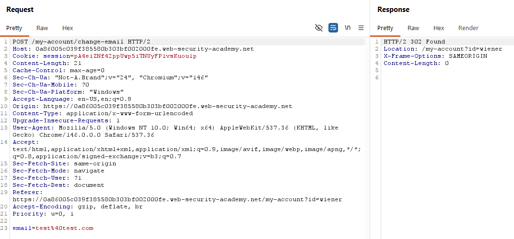

**2. Konstrukcija CSRF PoC-a**

Pošto zahtev nema nikakvu zaštitu, dovoljna je obična HTML forma koja cilja endpoint za promenu email-a, sa JavaScript-om koji je automatski submituje čim se stranica učita:

```html
<html>
  <body>
    <form action="https://YOUR-LAB-ID.web-security-academy.net/my-account/change-email" method="POST">
      <input type="hidden" name="email" value="hacked@evil.com" />
    </form>
    <script>
      document.forms[0].submit();
    </script>
  </body>
</html>
```

**3. Postavljanje payload-a na exploit server**

Kliknuo sam **"Go to exploit server"** na lab stranici i nalepio HTML payload u **Body** polje.

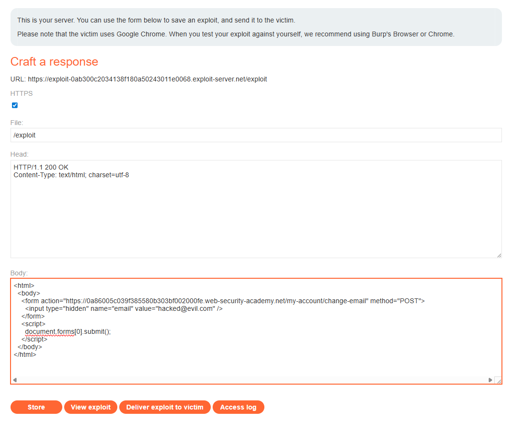

**4. Testiranje PoC-a**

Klikom na **"View exploit"** payload se izvršio u mojoj sesiji — forma se automatski submitovala i promenila moj email. Verifikovao sam na "My account" stranici da je email promenjen na `hacked@evil.com`.

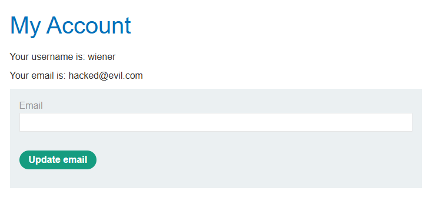

**5. Isporuka žrtvi**

Klikom na **"Deliver exploit to victim"** lab simulira da ulogovana žrtva posećuje napadačevu stranicu. Email žrtve je promenjen i lab je rešen.

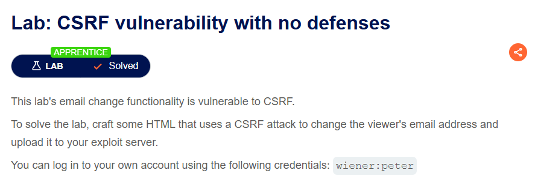

### Zašto je napad uspeo

Aplikacija se za autentifikaciju state-changing zahteva oslanja **isključivo na sesijski cookie**. Pošto browser automatski prilaže cookie uz svaki zahtev ka domenu aplikacije — uključujući i zahteve iniciran sa napadačevog sajta — server ne može da razlikuje legitiman zahtev od podmetnutog. Nema CSRF tokena, nema provere `Origin`/`Referer` header-a, nema `SameSite` ograničenja. Odbrana bi bila uvođenje synchronizer CSRF tokena vezanog za sesiju i/ili postavljanje `SameSite=Lax` ili `Strict` atributa na sesijski cookie.

---

## Lab 2: CSRF where token validation depends on request method

**Težina:** Apprentice
**Cilj:** Aplikacija ima CSRF token, ali ga validira samo za POST metodu. Promenom metode u GET validacija se preskače.
**Kredencijali:** `wiener:peter`

### Koraci rešavanja

**1. Analiza zahteva**

Ulogovao sam se kao `wiener` i uhvatio `POST /my-account/change-email` zahtev. Za razliku od Lab 1, telo zahteva ovog puta sadrži i CSRF token:

```
email=test@test.com&csrf=AbC123XyZ...
```

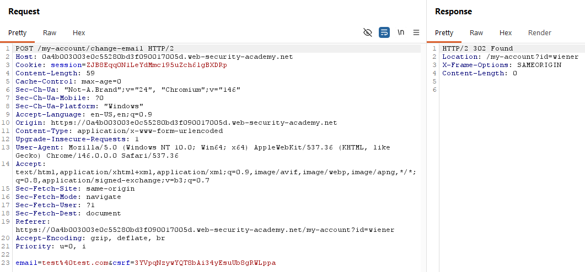

**2. Potvrda da se token validira za POST**

Poslao sam zahtev u Repeater i izmenio vrednost `csrf` parametra u nevalidnu. Server je odgovorio `400 Bad Request` — za POST metodu token se proverava.

**3. Promena HTTP metode u GET**

U Repeater-u sam upotrebio opciju **"Change request method"** koja je konvertovala zahtev iz POST u GET (parametri iz tela prešli su u query string). Poslao sam zahtev sa **i dalje nevalidnim** CSRF tokenom. Server je odgovorio `200 OK` — zahtev je prihvaćen uprkos nevalidnom tokenu, što dokazuje da se za GET metodu token uopšte ne validira.

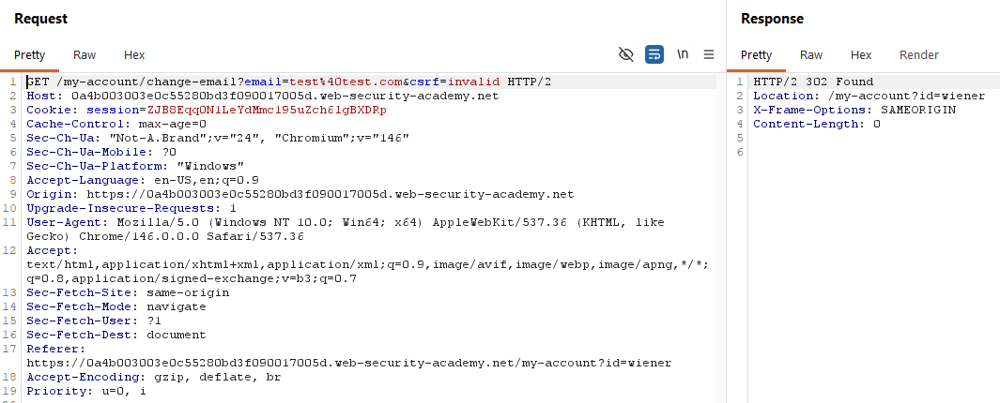

**4. Konstrukcija CSRF PoC-a sa GET metodom**

Pošto GET zahtev ne zahteva validan token, payload je forma sa `method="GET"` i bez `csrf` polja:

```html
<html>
  <body>
    <form action="https://YOUR-LAB-ID.web-security-academy.net/my-account/change-email" method="GET">
      <input type="hidden" name="email" value="hacked@evil.com" />
    </form>
    <script>
      document.forms[0].submit();
    </script>
  </body>
</html>
```

**5. Postavljanje na exploit server i testiranje**

Nalepio sam payload u Body polje exploit servera i kliknuo "View exploit" — email je promenjen u mojoj sesiji, što sam verifikovao na "My account".

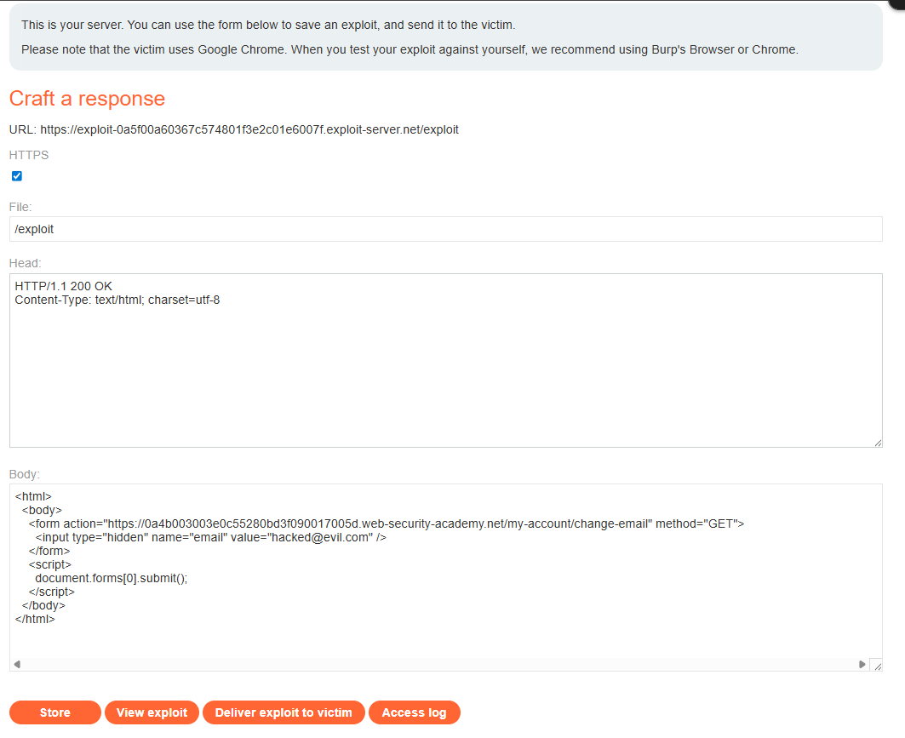

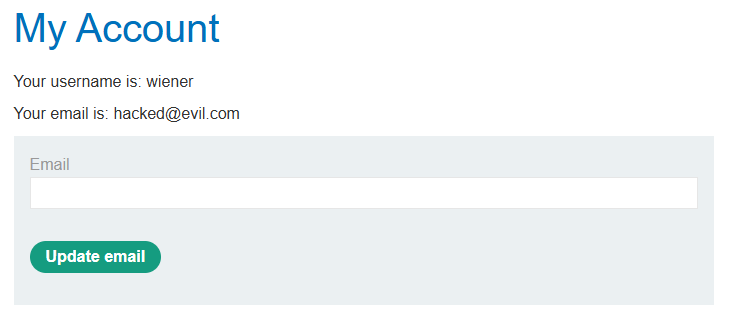

**6. Isporuka žrtvi**

Klikom na "Deliver exploit to victim" lab je rešen.

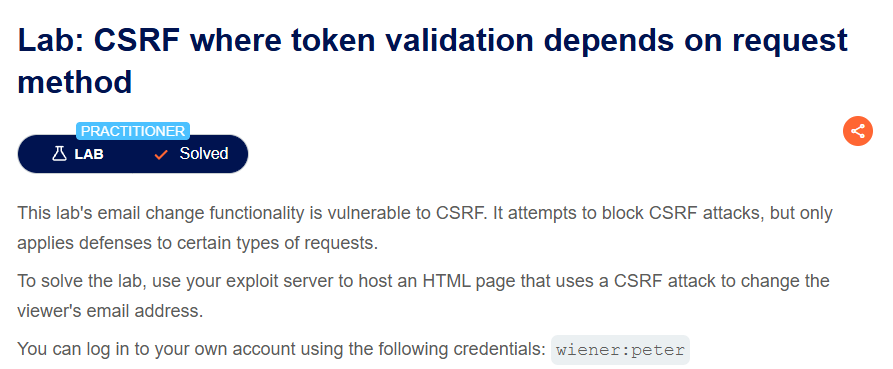

### Zašto je napad uspeo

Aplikacija primenjuje CSRF validaciju **selektivno po HTTP metodi** — proverava token za POST, ali ne i za GET. Ovo je verovatno posledica nepotpune implementacije gde je server konfigurisan da prihvata isti endpoint preko više metoda, ali je CSRF provera dodata samo na jednu granu. Napadač jednostavno bira metodu koja zaobilazi proveru. Ispravna odbrana zahteva da se CSRF token validira za **sve** state-changing zahteve bez obzira na metodu, i da endpoint koji menja stanje uopšte ne bude dostupan preko GET metode.

---

## Lab 3: CSRF where token validation depends on token being present

**Težina:** Practitioner
**Cilj:** Aplikacija ispravno validira CSRF token kada je prisutan, ali ako se parametar potpuno izostavi, validacija se preskače.
**Kredencijali:** `wiener:peter`

### Koraci rešavanja

**1. Analiza zahteva**

Ulogovao sam se kao `wiener` i uhvatio `POST /my-account/change-email` zahtev sa `email` i `csrf` parametrom u telu.

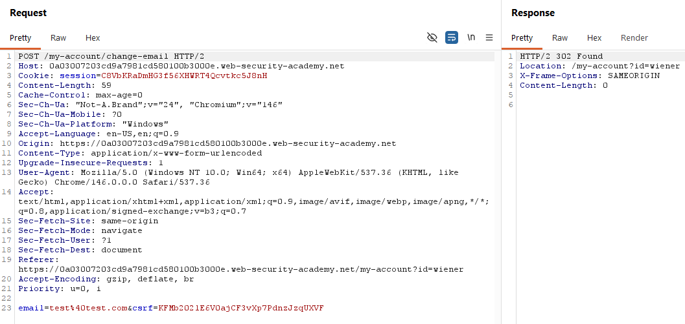

**2. Testiranje logike validacije**

Poslao sam zahtev u Repeater i sproveo dva testa:

- **Test A — nevalidan token:** izmenio sam vrednost `csrf` parametra u pogrešnu. Server je vratio `400 Bad Request` — token se proverava kada je prisutan.
- **Test B — izostavljen token:** obrisao sam **ceo** `csrf` parametar iz tela zahteva (i ime i vrednost). Telo je ostalo samo `email=test@test.com`. Server je vratio `200 OK` — zahtev je prihvaćen.

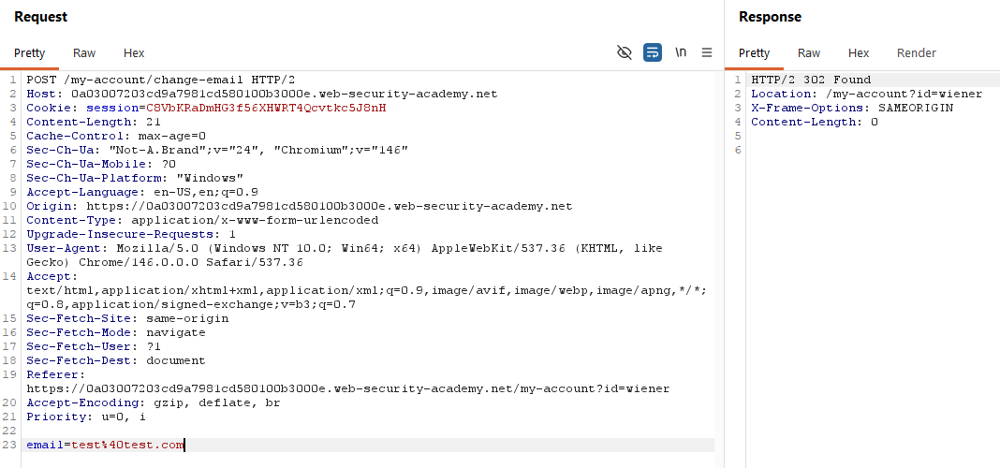

Logika validacije na serveru očigledno glasi: "ako je token prisutan, proveri ga; ako nije prisutan, propusti zahtev".

**3. Konstrukcija CSRF PoC-a bez tokena**

Payload je standardna POST forma, ali **bez** `csrf` skrivenog polja:

```html
<html>
  <body>
    <form action="https://YOUR-LAB-ID.web-security-academy.net/my-account/change-email" method="POST">
      <input type="hidden" name="email" value="hacked@evil.com" />
    </form>
    <script>
      document.forms[0].submit();
    </script>
  </body>
</html>
```

**4. Postavljanje na exploit server i testiranje**

Nalepio sam payload u Body polje, kliknuo "View exploit" i verifikovao promenu email-a na "My account" stranici.

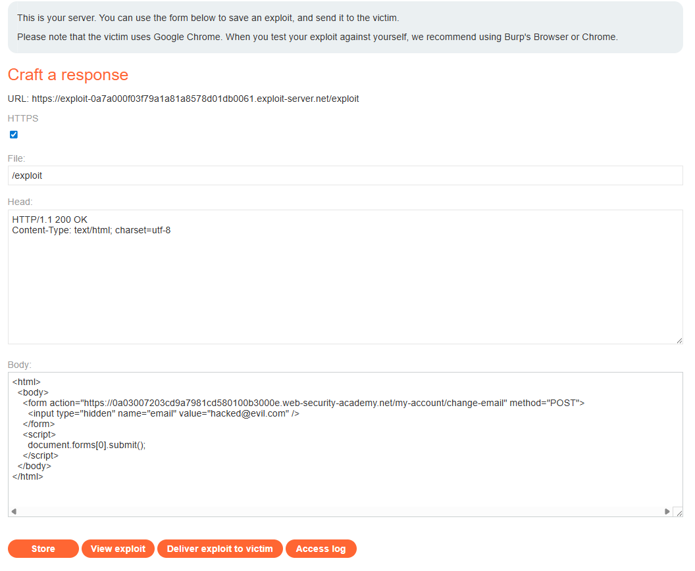

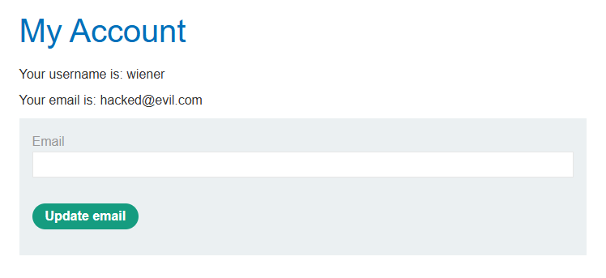

**5. Isporuka žrtvi**

Klikom na "Deliver exploit to victim" lab je rešen.

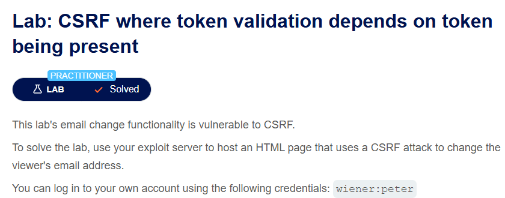

### Zašto je napad uspeo

Implementacija validacije pravi grešku da CSRF proveru uslovljava **prisustvom** parametra umesto da je bezuslovno zahteva. Ovaj obrazac često nastaje iz defenzivnog koda tipa `if (request.getParameter("csrf") != null) { validate(); }` — proverava se samo ako token postoji. Napadač zaobilazi zaštitu prostim izostavljanjem parametra. Ispravna odbrana je da server **odbije svaki state-changing zahtev** koji ne sadrži validan token — odsustvo tokena mora da se tretira kao greška, ne kao izuzetak od provere.

---

## Lab 4: CSRF where token is not tied to user session

**Težina:** Practitioner
**Cilj:** Aplikacija ispravno validira CSRF token, ali token nije vezan za korisničku sesiju — token jednog korisnika radi za drugog.
**Kredencijali:** `wiener:peter` i `carlos:montoya`

### Koraci rešavanja

**1. Analiza zahteva**

Ulogovao sam se kao `wiener` i uhvatio `POST /my-account/change-email` zahtev sa `email` i `csrf` parametrom.

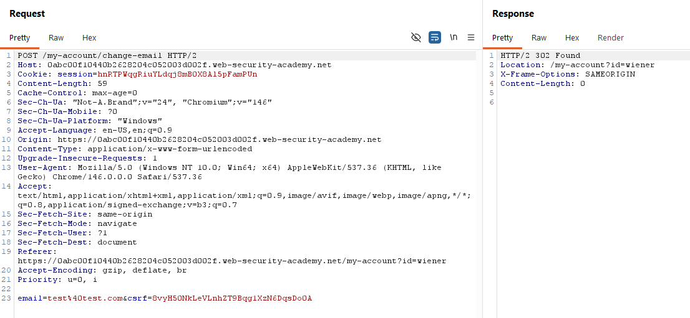

**2. Potvrda da se token ispravno validira**

U Repeater-u sam proverio da prethodni bypass-ovi ne rade:

- Nevalidan token → `400 Bad Request`
- Izostavljen token → `400 Bad Request`

Dakle token se ispravno validira — mora biti prisutan i tačan. Preostalo pitanje je da li je vezan za sesiju.

**3. Pribavljanje tokena iz druge sesije**

U odvojenom inkognito prozoru ulogovao sam se kao `carlos` (`carlos:montoya`) i sa "My account" stranice pribavio carlos-ov CSRF token (iz HTML source-a forme za promenu email-a).

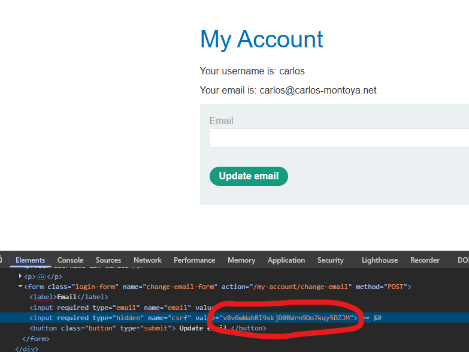

**4. Testiranje token-sesija vezivanja**

Vratio sam se u Repeater na wiener-ov zahtev i zamenio `csrf` vrednost sa **carlos-ovim** tokenom. Server je odgovorio `200 OK` — prihvatio je carlos-ov token u wiener-ovoj sesiji. Ovo dokazuje da **token nije vezan za sesiju**: bilo koji validan token radi za bilo kog korisnika.

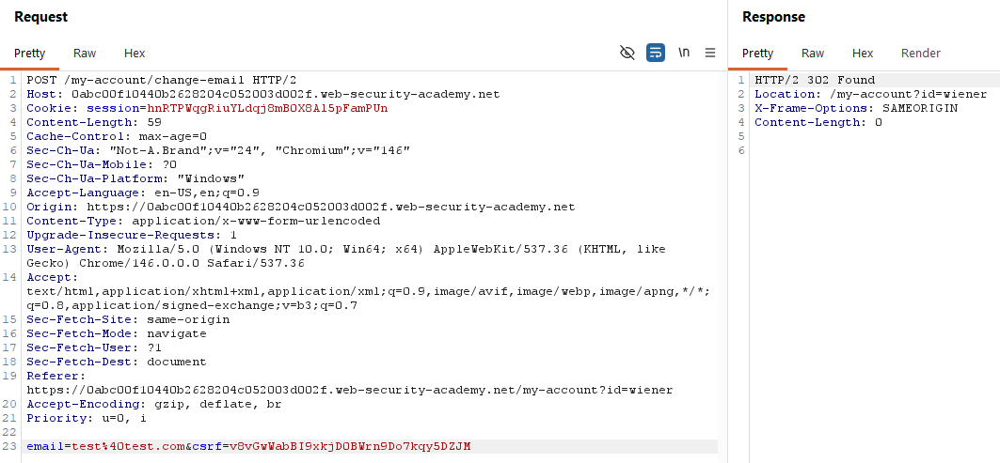

**5. Konstrukcija CSRF PoC-a sa pribavljenim tokenom**

Logika napada: napadač se uloguje na svoj nalog, pribavi validan token, i ugradi ga u payload. Pošto token nije vezan za sesiju, radiće u žrtvinoj sesiji:

```html
<html>
  <body>
    <form action="https://YOUR-LAB-ID.web-security-academy.net/my-account/change-email" method="POST">
      <input type="hidden" name="email" value="hacked@evil.com" />
      <input type="hidden" name="csrf" value="CARLOS-CSRF-TOKEN" />
    </form>
    <script>
      document.forms[0].submit();
    </script>
  </body>
</html>
```

**6. Postavljanje na exploit server i isporuka**

Nalepio sam payload sa svežim carlos-ovim tokenom u Body polje exploit servera. Pošto su CSRF tokeni u ovom labu jednokratni, bilo je potrebno pribaviti svež token i izvršiti isporuku pre nego što token istekne — "View exploit" korak troši token, pa sam nakon testiranja pribavio nov token i kliknuo direktno na "Deliver exploit to victim".

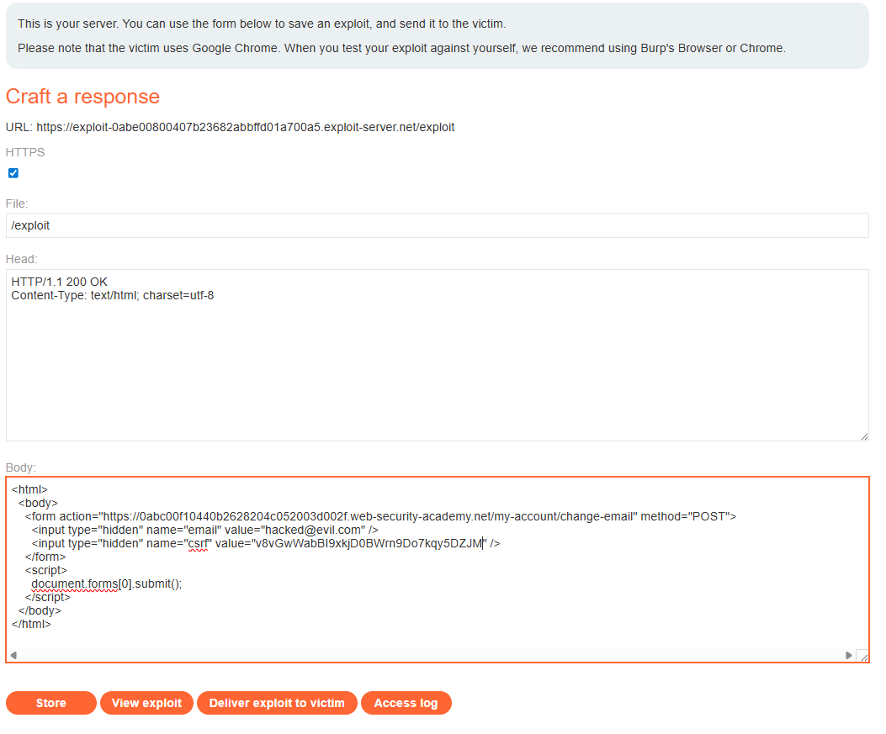

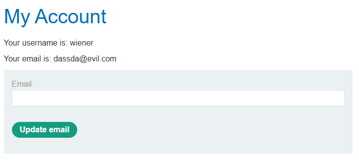

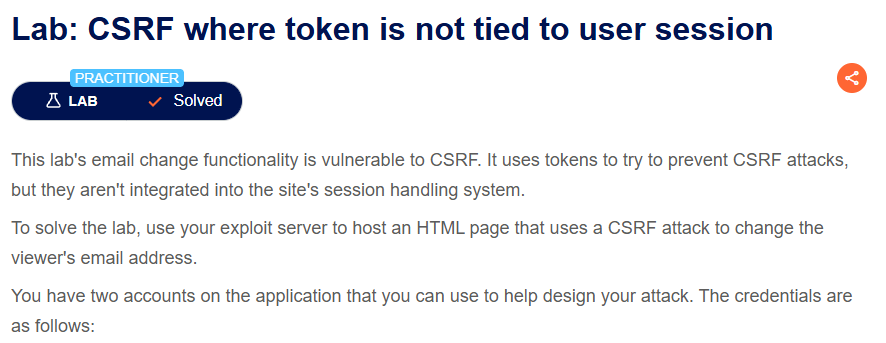

### Zašto je napad uspeo

Server validira da je CSRF token **kriptografski validan**, ali ne proverava i da li token **pripada sesiji** koja šalje zahtev. Token se verovatno čuva u nekom globalnom poolu validnih tokena umesto da bude vezan za konkretnog korisnika. Time napadač može da pribavi legitiman token sa sopstvenog naloga i upotrebi ga u CSRF napadu na žrtvu — token "važi" za sve. Ispravna odbrana zahteva da token bude **kriptografski vezan za korisničku sesiju** (npr. HMAC nad session ID-jem, ili token koji se čuva uz konkretnu sesiju na serveru) tako da token jednog korisnika nikada ne prolazi validaciju u sesiji drugog.

---

## Lab 5: CSRF where Referer validation depends on header being present

**Težina:** Practitioner
**Cilj:** Aplikacija se brani proverom `Referer` header-a, ali ako header potpuno izostane, provera se preskače. Treba napraviti payload koji navede browser da ne pošalje Referer.
**Kredencijali:** `wiener:peter`

### Koraci rešavanja

**1. Analiza zahteva**

Ulogovao sam se kao `wiener` i uhvatio `POST /my-account/change-email` zahtev. Telo zahteva sadrži **samo** `email` parametar (nema CSRF tokena), a u header-ima je prisutan `Referer` header koji pokazuje na lab domen.

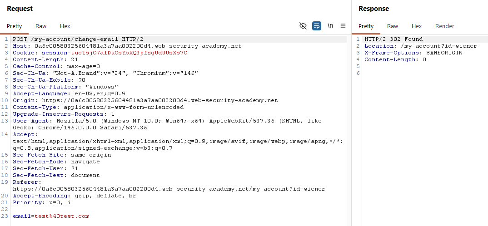

**2. Testiranje Referer validacije**

U Repeater-u sam sproveo dva testa:

- **Test A — izmenjen Referer:** promenio sam vrednost `Referer` header-a u `https://evil.com`. Server je vratio `400 Bad Request` — Referer se proverava.
- **Test B — obrisan Referer:** obrisao sam ceo `Referer` header. Server je vratio `200 OK` — zahtev je prihvaćen.

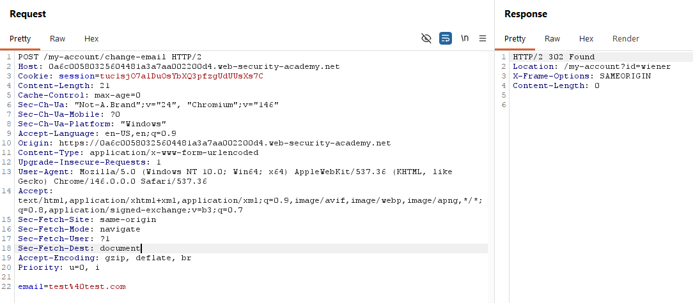

Logika validacije glasi: "ako je Referer prisutan, proveri ga; ako nije prisutan, propusti".

**3. Problem: navesti browser da ne pošalje Referer**

Browser po defaultu uvek šalje `Referer` header pri submitovanju forme. Da bih sprečio slanje Referer-a, upotrebio sam `<meta name="referrer" content="no-referrer">` tag — to je mehanizam koji govori browseru da ne prilaže Referer header ni za jedan zahtev koji potiče sa te stranice.

**4. Konstrukcija CSRF PoC-a sa no-referrer politikom**

```html
<html>
  <head>
    <meta name="referrer" content="no-referrer">
  </head>
  <body>
    <form action="https://YOUR-LAB-ID.web-security-academy.net/my-account/change-email" method="POST">
      <input type="hidden" name="email" value="hacked@evil.com" />
    </form>
    <script>
      document.forms[0].submit();
    </script>
  </body>
</html>
```

Ključni deo je `<meta name="referrer" content="no-referrer">` u `<head>` sekciji — bez njega bi browser poslao Referer sa exploit server domena i zahtev bi bio odbijen.

**5. Postavljanje na exploit server i testiranje**

Nalepio sam payload u Body polje, kliknuo "Store" pa "View exploit", i verifikovao promenu email-a na "My account".

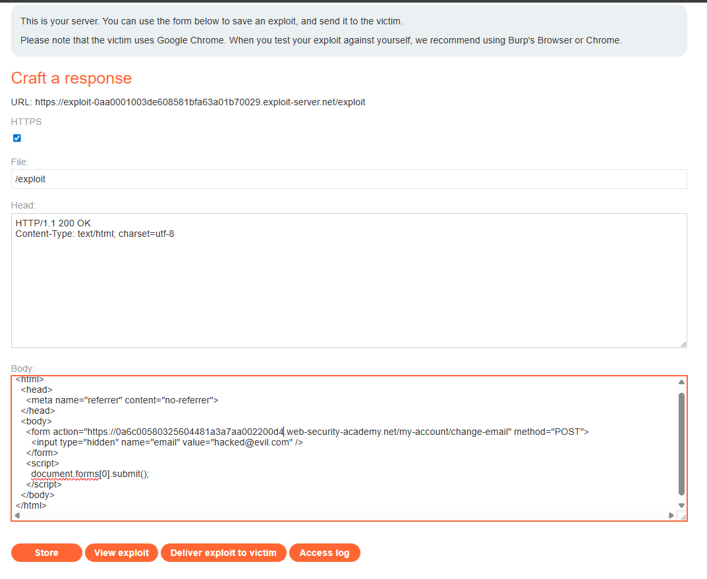

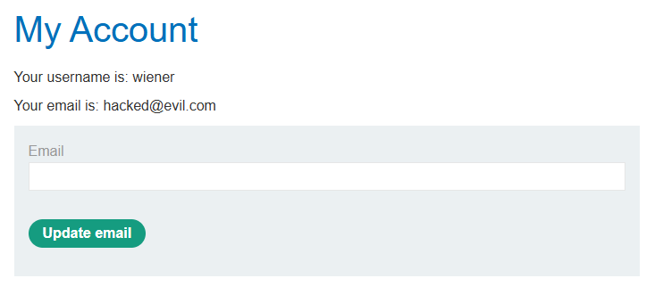

**6. Isporuka žrtvi**

Klikom na "Deliver exploit to victim" lab je rešen.

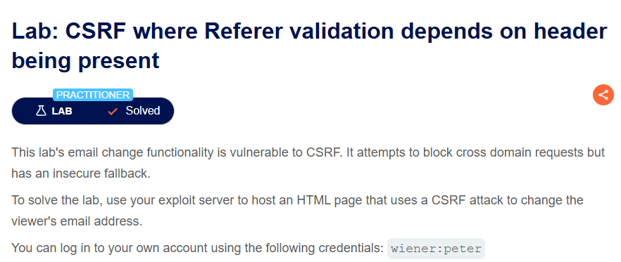

### Zašto je napad uspeo

Aplikacija koristi `Referer` header kao CSRF odbranu, ali validaciju uslovljava **prisustvom** header-a — ako Referer nedostaje, provera se preskače umesto da se zahtev odbije. Pošto napadač može da kontroliše da li će browser poslati Referer (preko `Referrer-Policy` / `<meta>` referrer tag-a), ova odbrana se trivijalno zaobilazi. Pored toga, Referer validacija je sama po sebi slaba osnova za CSRF zaštitu — header se može izostaviti, a u nekim slučajevima i manipulisati. Ispravna odbrana je primarno oslanjanje na synchronizer CSRF token vezan za sesiju; ako se Referer/Origin provera koristi, ona mora biti **stroga** — zahtev bez header-a ili sa header-om koji ne odgovara očekivanom domenu mora biti **odbijen**, nikad propušten.

---
