# Server-Side Request Forgery (SSRF)

## Analiza odbrane

### 1. Objašnjenje klase napada

**Server-Side Request Forgery (SSRF)** je ranjivost u kojoj napadač navodi server da pošalje HTTP zahtev na proizvoljnu lokaciju koju napadač kontroliše. Umesto da server pristupa samo onim resursima koje aplikacija legitimno koristi, napadač uspeva da preusmeri taj zahtev ka:

- **Lokalnim servisima** na samom serveru (`http://localhost/admin`, `http://127.0.0.1:8080`)
- **Internim sistemima** unutar privatne mreže organizacije (`http://192.168.0.5`, `http://internal-db`)
- **Cloud metadata endpoint-ima** (`http://169.254.169.254/` na AWS/Azure/GCP — vraća IAM kredencijale)
- **Eksternim sistemima** koje napadač koristi za detekciju ranjivosti (out-of-band tehnika)

Ključ napada je **zloupotreba poverenja** — server ima mrežni pristup i privilegije koje napadač sa interneta nema. Napadač "pozajmljuje" identitet servera da bi pristupio resursima koji bi mu inače bili nedostupni.

Tipičan ulazni vektor je bilo koji parametar koji aplikacija koristi za pravljenje HTTP zahteva — URL za preuzimanje slike, webhook URL, "stock check" servis, PDF generator iz URL-a, import sa udaljenog izvora, ili manje očigledna mesta kao što je `Referer` header (analytics sistemi često prate referer URL-ove).

SSRF se deli na **non-blind** (server vrati sadržaj sa interne destinacije nazad napadaču) i **blind** (server pravi internal zahtev ali odgovor ne vraća — napadač mora da koristi out-of-band tehnike za detekciju).

### 2. Uticaj iskorištenja (impact)

- **Pristup internim servisima** koji nemaju autentifikaciju jer "veruju" lokalnoj mreži (admin paneli, baze podataka, monitoring sistemi, dashboardi)
- **Krađa cloud kredencijala** preko metadata servisa — najpoznatiji slučaj je **Capital One breach 2019.** gde je napadač kroz SSRF preuzeo IAM role credentials sa AWS metadata endpoint-a i exfiltrovao podatke o **preko 100 miliona korisnika**
- **Internal port scanning** i mapiranje mreže — napadač detektuje koji servisi rade interno na osnovu razlike u response-ovima ili vremenu odziva
- **Remote Code Execution** kroz interne servise (npr. Redis, Elasticsearch, Jenkins, koji pretpostavljaju da je svaki klijent unutar mreže poverljiv)
- **Bypass firewall-a i WAF-a** — zahtev poreklom od servera prolazi kroz pravila koja blokiraju eksterni saobraćaj
- **Otkrivanje osetljivih podataka** iz fajl sistema preko `file://` šeme (ako je dozvoljena)
- **Denial of Service** — usmeravanje zahteva ka resursima koji izazivaju iscrpljenje (velike datoteke, beskonačne redirekcije, slow-loading servisi)

### 3. Ranjivosti u softveru koje su omogućile napad

SSRF nastaje kada se kombinuju neka od sledećih propusta u dizajnu:

- **Nedostatak validacije korisničkog unosa** koji se prosleđuje funkcijama za pravljenje HTTP zahteva (`curl`, `requests.get`, `fetch`, `URL.openStream`, itd.)
- **Implicitno poverenje u lokalnu mrežu** — interni servisi nemaju autentifikaciju jer pretpostavljaju da niko van mreže ne može da im pristupi
- **Loše napisani blacklist filteri** koji se mogu zaobići — npr. blokira se string `127.0.0.1`, ali ne i ekvivalenti: `localhost`, `0.0.0.0`, `[::1]`, `2130706433` (decimalni IP), `127.1`, `127.0.0.1.nip.io`
- **Inkonsistentnost u URL parsiranju** — razlika između URL parsera u filteru i HTTP klijentu (TOCTOU problem). Npr. `http://expected-host@evil.com/` — primitivan parser vidi `expected-host`, ali HTTP klijent zna da je userinfo i pravi stvar je `evil.com`
- **Praćenje redirekcija bez ponovne validacije** — aplikacija proverava prvi URL, ali sledi 302 redirect na bilo gde
- **Otvorene URL šeme** koje nisu potrebne — `file://`, `gopher://`, `dict://`, `ftp://` često nemaju legitiman use case i otvaraju dodatne napade
- **Otkrivanje informacija u greškama** — različiti error message-i za otvoren/zatvoren port omogućavaju port scanning
- **DNS rebinding** — TOCTOU ranjivost gde DNS prvo vraća dozvoljenu IP adresu (prilikom validacije), a zatim internu IP (prilikom samog zahteva)

### 4. Kontramere (odbrana)

**Primarne odbrane (treba kombinovati više njih):**

- **Allowlist umesto blacklist-a** — eksplicitno definisati koje su domene/IP adrese dozvoljene. Sve ostalo se odbija. Blacklist je gotovo uvek moguće zaobići.
- **Validacija URL-a u dva koraka:**
  1. Parsirati URL i izvući hostname
  2. Resolve-ovati hostname u IP adresu
  3. Proveriti da IP **nije** u privatnim opsezima (RFC1918: `10.0.0.0/8`, `172.16.0.0/12`, `192.168.0.0/16`), loopback (`127.0.0.0/8`), link-local (`169.254.0.0/16`), itd.
  4. Koristiti **tu istu IP adresu** za pravljenje zahteva (sprečava DNS rebinding)
- **Whitelisting URL šema** — dozvoliti samo `http://` i `https://`, blokirati `file://`, `gopher://`, `dict://`, `ftp://`
- **Onemogućiti praćenje redirekcija** ili svaki redirect target ponovo validirati istim algoritmom

**Mrežno-arhitekturalne odbrane (defense in depth):**

- **Segmentacija mreže** — server koji pravi izlazne HTTP zahteve postaviti u zasebnu mrežu (DMZ) bez pristupa internim servisima
- **Egress firewall pravila** — blokirati izlazne zahteve sa aplikativnog servera prema internim opsezima i metadata endpoint-ima (`169.254.169.254`)
- **IMDSv2 na AWS** (umesto v1) — zahteva session token koji se ne može dobaviti običnim GET zahtevom, drastično smanjuje SSRF impact na cloud metadata
- **Autentifikacija svih internih servisa** — ne pretpostavljati da je lokalna mreža bezbedna (zero trust princip)

**Ostale dobre prakse:**

- **Generičke poruke o grešci** — ne odavati razliku između "host nedostupan", "konekcija odbijena", i "200 OK" — sve treba da izgleda isto napadaču
- **Limitiranje veličine response-a i timeout-a** — sprečava DoS i smanjuje exfiltraciju
- **Logovanje i monitoring** neuobičajenih izlaznih zahteva sa servera (zahtevi ka `127.0.0.1`, `169.254.x`, internim IP-ovima)
- **Sandboxing** — kod koji pravi outbound zahteve izvršiti u izolovanom procesu/kontejneru bez network access-a osim ka eksplicitnim destinacijama

---

## Lab 1: Basic SSRF against the local server

**Težina:** Apprentice
**Cilj:** Iskoristiti SSRF ranjivost u "Check stock" funkcionalnosti aplikacije za pristup admin panelu na `http://localhost/admin` i obrisati korisnika `carlos`.

### Koraci rešavanja

**1. Mapiranje funkcionalnosti aplikacije**

Pristupio sam product stranici i kliknuo dugme **"Check stock"**. U Burp Suite-u, pod **Proxy → HTTP history**, pronašao sam `POST /product/stock` zahtev. Telo zahteva sadrži parametar `stockApi` sa URL-encoded vrednošću:

```
stockApi=http://stock.weliketoshop.net:8080/product/stock/check?productId=1&storeId=1
```

Aplikacija dakle prihvata kompletan URL od korisnika i sa svoje strane pravi HTTP zahtev na tu adresu — to je tipičan SSRF vektor.

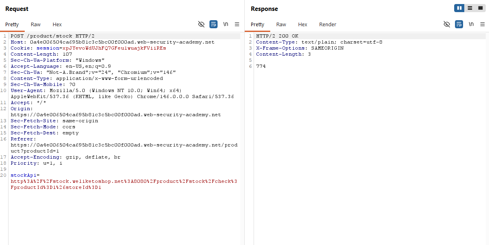

**2. Modifikacija stockApi parametra ka localhost-u**

Poslao sam zahtev u **Repeater** (`Ctrl+R`) i zamenio vrednost `stockApi` sa:

```
stockApi=http://localhost/admin
```

Server je odgovorio `200 OK` sa HTML sadržajem **admin panela** — listom korisnika (`wiener`, `carlos`) i pratećim `Delete` linkovima. Admin panel je inače dostupan samo za zahteve sa `localhost`-a, ali pošto je `localhost` sa perspektive servera upravo on sam, SSRF zahtev se tretira kao legitiman administrativni pristup.

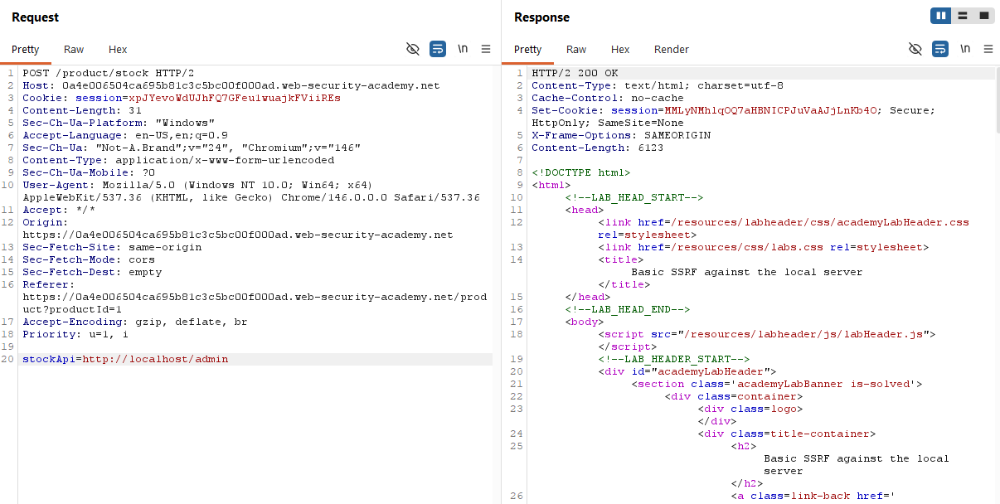

**3. Izvršavanje akcije — brisanje carlos-a**

Iz HTML-a admin panela izvukao sam URL za brisanje korisnika: `/admin/delete?username=carlos`. Modifikovao sam `stockApi` u:

```
stockApi=http://localhost/admin/delete?username=carlos
```

Server je izvršio brisanje i vratio admin panel u kome se `carlos` više ne nalazi.

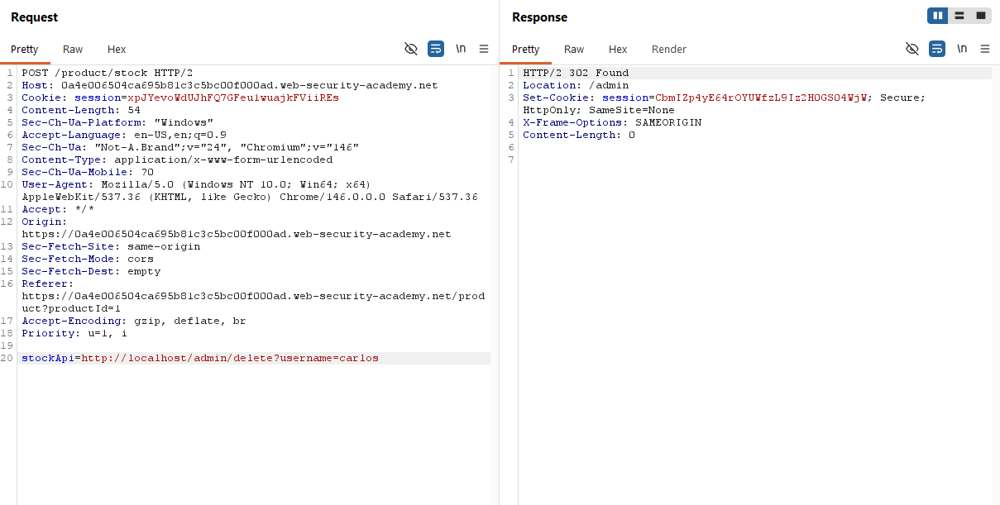

**4. Verifikacija**

Refresh-ovao sam lab tab u Burp browseru — pojavio se zeleni banner **"Congratulations, you solved the lab!"**.

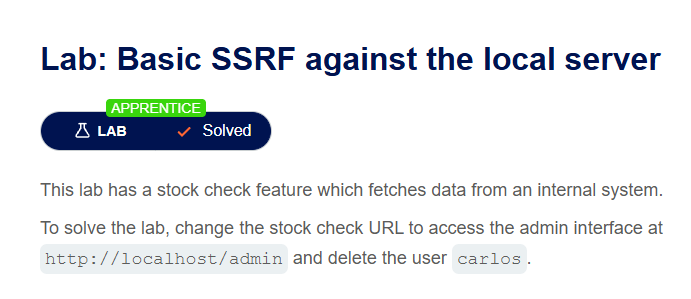

### Zašto je napad uspeo

Aplikacija prihvata proizvoljan URL u `stockApi` parametru bez ikakve validacije. Server slepo pravi HTTP zahtev na tu adresu i vraća odgovor klijentu. Admin panel nema autentifikaciju za zahteve sa `localhost`-a (implicitno poverenje u lokalnu mrežu), pa napadač može kompletno preuzeti administrativne akcije.

---

## Lab 2: Basic SSRF against another back-end system

**Težina:** Apprentice
**Cilj:** Pronaći skriveni admin panel u opsegu interne mreže `192.168.0.0/24` na portu 8080 i obrisati korisnika `carlos`.

### Koraci rešavanja

**1. Inicijalno snimanje zahteva**

Kao i u prethodnom labu, pristupio sam product stranici i pokrenuo "Check stock" da uhvatim `POST /product/stock` zahtev u Burp HTTP history-ju.

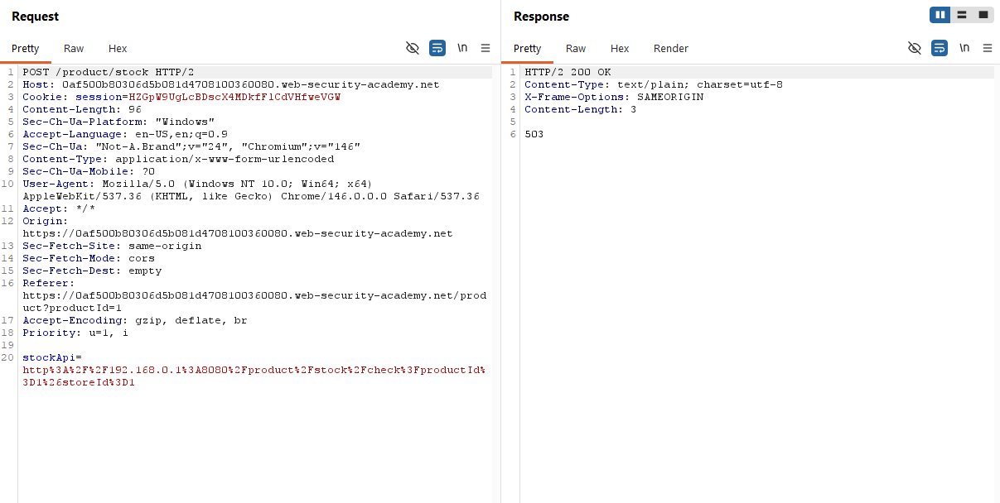

**2. Korišćenje Burp Intruder-a za skeniranje opsega**

Pošto admin panel nije na poznatoj IP adresi, već "negde u opsegu `192.168.0.X:8080/admin`", ručno isprobavanje 255 mogućih adresa bilo bi nepraktično. Zahtev sam poslao u **Intruder** (`Ctrl+I`).

U **Positions** tabu kliknuo sam **"Clear §"** da uklonim auto-generisane markere, zatim sam u `stockApi` parametru postavio payload poziciju oko zadnjeg okteta IP adrese:

```
stockApi=http://192.168.0.§1§:8080/admin
```

**Attack type:** ostavio sam podrazumevani **Sniper** (jedan payload position).

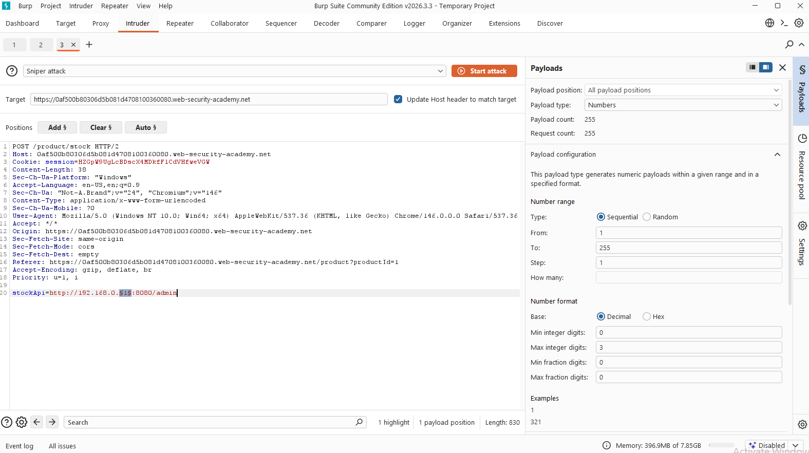

**3. Konfiguracija payload-a**

U **Payloads** tabu, **Payload type** postavio sam na **Numbers** i konfigurisao:
- **From:** 1
- **To:** 255
- **Step:** 1
- **Number format:** Decimal, integer

Time generišem 255 zahteva, po jedan za svaku moguću IP adresu u opsegu.

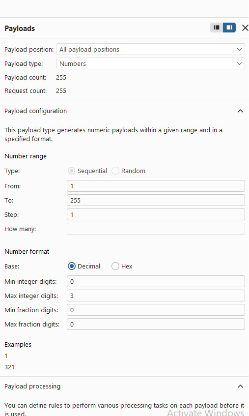

**4. Pokretanje napada i analiza rezultata**

Pokrenuo sam napad klikom na **Start attack**. Nakon završetka, sortirao sam rezultate po koloni **Length** kako bih našao odgovor koji se razlikuje od ostalih.

Većina zahteva vratila je `500 Internal Server Error` sa porukom *"Could not connect to external stock check service"* (Length ~2454) — što znači da admin panel nije na tim IP adresama. Jedan zahtev — **payload 149** — vratio je `200 OK` sa znatno većim response-om (~3000 bajtova).

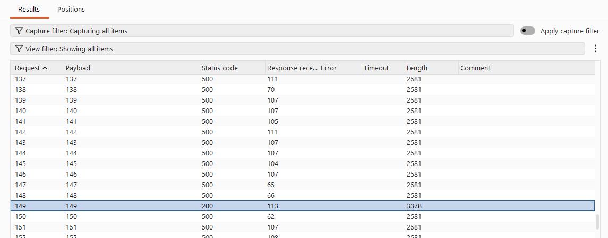

**5. Verifikacija pronađene IP adrese**

Pregled response-a za payload 149 potvrdio je da je to interni admin panel — vraćen je HTML sa listom korisnika i `Delete` linkovima. Admin panel je dakle na `192.168.0.149:8080/admin`.

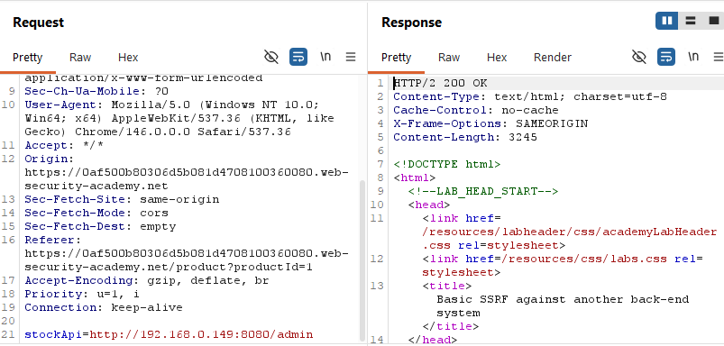

**6. Brisanje carlos-a**

U Repeater-u sam postavio:

```
stockApi=http://192.168.0.149:8080/admin/delete?username=carlos
```

Server je izvršio brisanje. Lab je rešen.

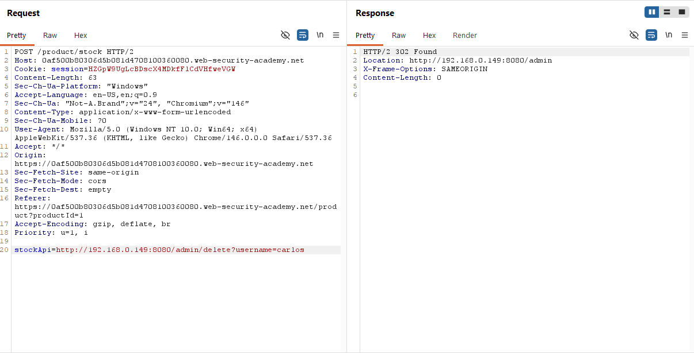

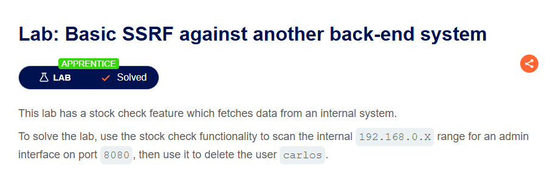

### Zašto je napad uspeo

Kao i u Lab 1, aplikacija prihvata proizvoljan URL bez validacije destinacije. Razlika je što ovde admin panel nije na samoj aplikaciji već na **drugoj internoj mašini** koja nije izložena javnom internetu. SSRF zaobilazi mrežnu izolaciju jer ranjivi server ima slobodan pristup celoj internoj mreži. Razlika u dužini response-a omogućila je tehniku **internal port/host scanning-a** kroz SSRF — sve negativne odgovore (`500 + "Could not connect"`) vraća konzistentno, dok pogodak na pravi servis vrati drugačiji sadržaj koji se filtrira sortiranjem po `Length` koloni.

---

## Lab 3: SSRF with blacklist-based input filter

**Težina:** Practitioner
**Cilj:** Iskoristiti SSRF za pristup `http://localhost/admin` i obrisati `carlos`. Aplikacija ima blacklist filter koji blokira uobičajene SSRF payload-e — filter mora da se zaobiđe.

### Koraci rešavanja

**1. Snimanje osnovnog zahteva**

Standardno snimanje `POST /product/stock` zahteva iz HTTP history-ja i slanje u Repeater.

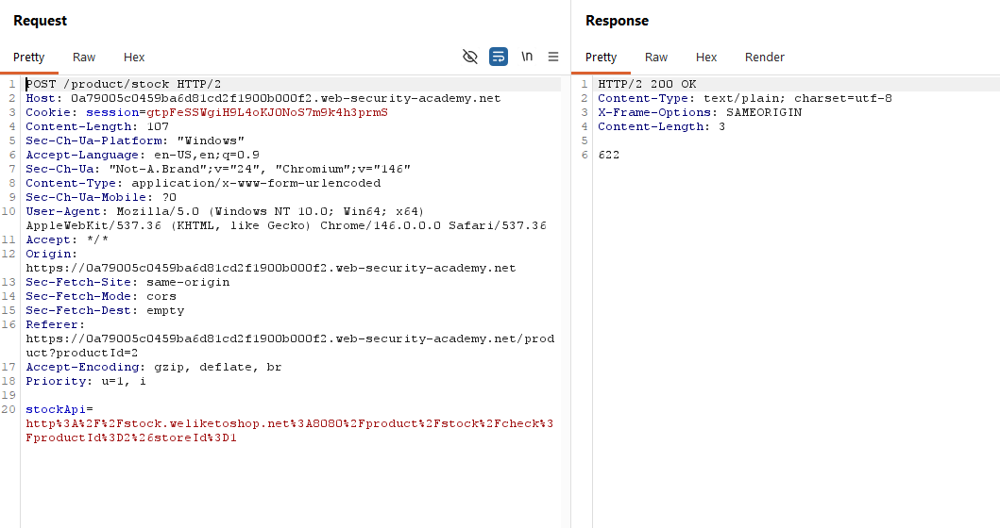

**2. Mapiranje filtera (differential analysis)**

Sistematski sam testirao različite payload-e da odredim šta filter blokira. Pristup razlaganja payload-a na delove i testiranja svakog odvojeno standardna je penetration testing tehnika.

- `stockApi=http://localhost/` → `400 "External stock check blocked for security reasons"` — string `localhost` je u blacklist-u

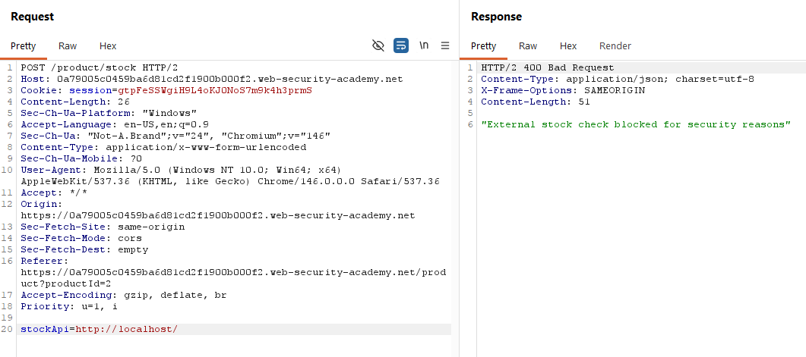

- `stockApi=http://127.0.0.1/` → `400 blocked` — i numerički oblik `127.0.0.1` je blokiran

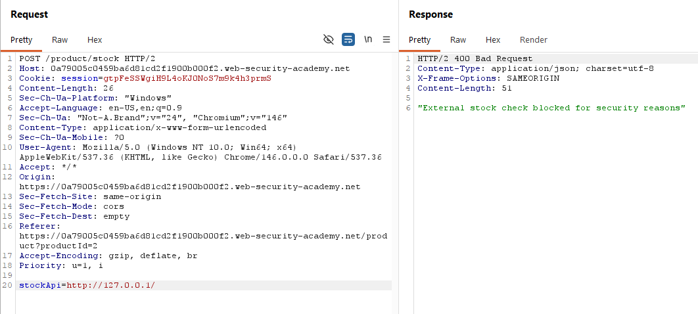

- `stockApi=http://127.1/` → `200 OK` sa shop home page sadržajem — **skraćeni oblik nije u blacklist-u**, a IP parser ga interno mapira u `127.0.0.1` (popunjava nedostajuće oktete)

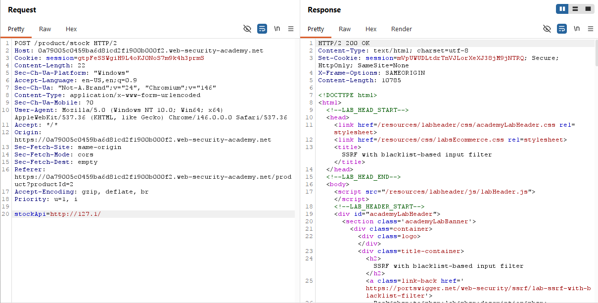

**3. Drugi sloj filtera**

Sa zaobiđenim hostom probao sam direktan put ka admin panelu:

```
stockApi=http://127.1/admin
```

Vraćeno `400 blocked`. Dakle filter blokira i string `admin` kao posebnu zabranjenu reč.

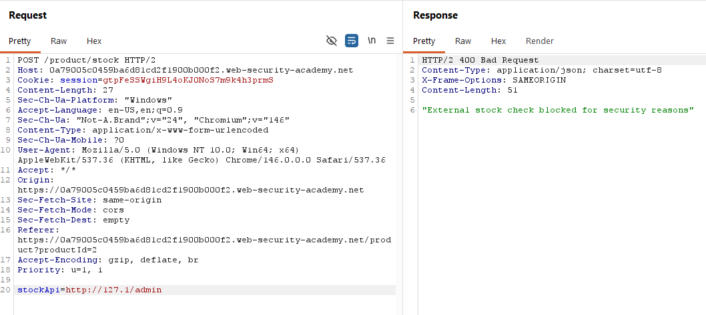

**4. Zaobiđenje preko URL encoding-a**

Pošto je `admin` blokiran kao string, pokušao sam **single URL encoding** prvog karaktera:

```
stockApi=http://127.1/%61dmin
```

`%61` je URL-encoded `a`. Rezultat: `400 blocked` — što znači da filter **sam dekoduje payload pre nego što ga proverava**. Filter vidi `admin` čak i kad je delom encoded.

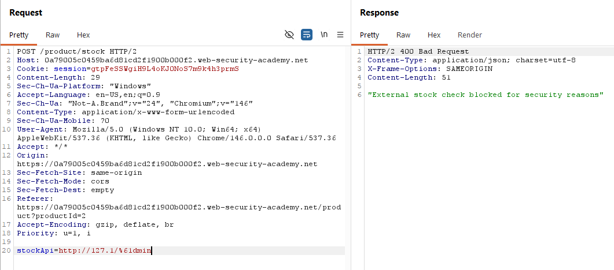

Pokušao sam **double encoding**:

```
stockApi=http://127.1/%2561dmin
```

`%2561` je dvostruko encoded `a` (`%25` je URL-encoded `%`, pa filter posle dekodiranja vidi `%61dmin`, što ne sadrži literal string `admin`). HTTP klijent kasnije dekoduje još jednom i pravi stvarni zahtev ka `/admin`. Rezultat: `200 OK` sa HTML-om admin panela. ✅

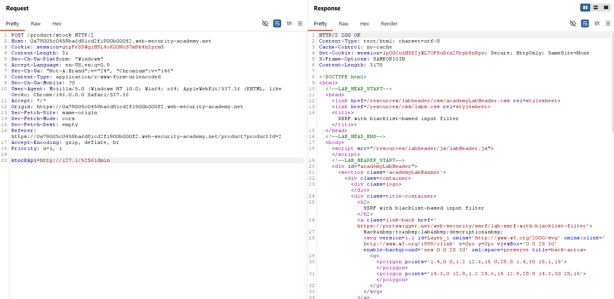

**5. Brisanje carlos-a**

Sa znanjem o oba sloja filtera, postavio sam finalni payload:

```
stockApi=http://127.1/%2561dmin/delete?username=carlos
```

Server je izvršio brisanje.

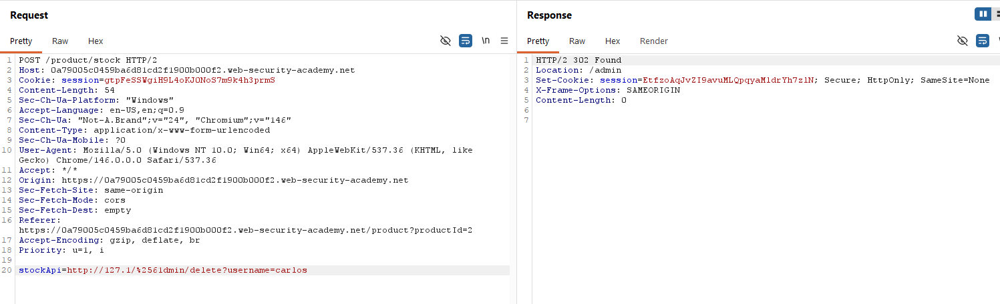

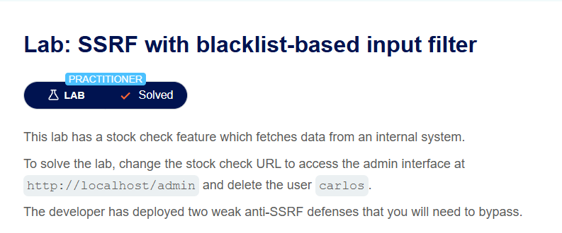

### Zašto je napad uspeo

Aplikacija je pokušala da spreči SSRF preko **blacklist**-a, ali blacklist je fundamentalno krhka odbrana. Filter je pokrivao samo doslovne stringove (`localhost`, `127.0.0.1`, `admin`), ali nije razumeo:

- **Da IP parser dopunjava nedostajuće oktete** — `127.1` se na transport sloju mapira u `127.0.0.1`, ali tekstualno poređenje sa blacklist-om to ne hvata
- **Da postoje višestruki slojevi URL dekodiranja** između filtera i finalnog HTTP zahteva, što omogućava double encoding bypass

Bezbedna odbrana bila bi **allowlist** dozvoljenih host-ova, ili rezolucija hostname-a u IP adresu i provera da IP nije u privatnim opsezima (uključujući `127.0.0.0/8`, `169.254.0.0/16`, RFC1918 opsege), praćena obaveznim korišćenjem te validirane IP adrese u pravljenju zahteva.

---

## Lab 4: SSRF with filter bypass via open redirection vulnerability

**Težina:** Practitioner
**Cilj:** Iskoristiti SSRF za pristup admin panelu na `http://192.168.0.12:8080/admin` i brisanje `carlos`. Strict whitelist filter onemogućava direktan napad — mora se zaobići preko lančanog korišćenja open redirect ranjivosti.

### Koraci rešavanja

**1. Analiza originalnog zahteva**

Pri snimanju `POST /product/stock` zahteva uočio sam ključnu razliku u odnosu na prethodne labove: `stockApi` **nije apsolutni URL** već **relativni path**:

```
stockApi=/product/stock/check?productId=1&storeId=1
```

To znači da aplikacija pravi internal zahtev ka **samoj sebi** (isti `web-security-academy.net` host). Filter će verovatno odbiti sve URL-ove koji ne odgovaraju ovom formatu.

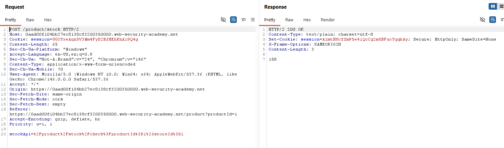

**2. Potvrda strict filtera**

Pokušao sam direktan SSRF payload da potvrdim hipotezu o strict whitelist-u:

```
stockApi=http://localhost/admin
```

Server je vratio `400 "Invalid external stock check url 'Invalid URL'"`. Filter parsira URL i odbacuje sve što ne odgovara očekivanom formatu. Naivni napad ne radi.

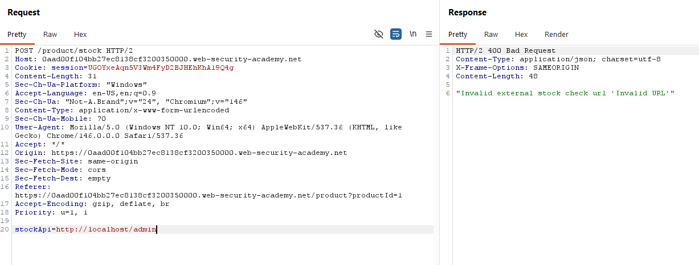

**3. Otkriće druge ranjivosti — open redirect**

Na product stranici primetio sam **"Next product"** link. Klikom sam u HTTP history-ju uhvatio zahtev:

```
GET /product/nextProduct?currentProductId=1&path=/product?productId=2
```

Parametar `path` kontroliše destinaciju redirect-a. Modifikovao sam ga u Repeater-u:

```
GET /product/nextProduct?currentProductId=1&path=http://192.168.0.12:8080/admin
```

Server je odgovorio `302 Found` sa header-om:

```
Location: http://192.168.0.12:8080/admin
```

Ovo potvrđuje **open redirect ranjivost** — aplikacija slepo gradi `Location` header iz korisničkog parametra bez ikakve validacije.

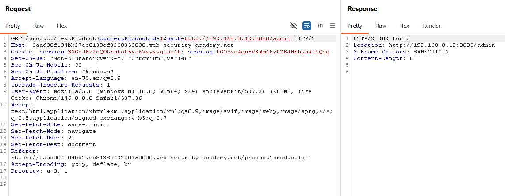

**4. Exploit chain — kombinovanje SSRF i open redirect-a**

Kombinovao sam dve ranjivosti — SSRF zahtev usmeren ka legitimnom relativnom path-u koji filter prihvata, a koji potom redirektuje ka željenoj internoj destinaciji:

```
stockApi=/product/nextProduct?path=http://192.168.0.12:8080/admin
```

Server interno:
1. Prihvata `path` jer izgleda kao legitiman relativni URL → filter zadovoljen
2. Pravi zahtev na `/product/nextProduct?path=...`
3. Dobija `302` redirect ka `http://192.168.0.12:8080/admin`
4. **HTTP klijent automatski prati redirect** (bez ponovne validacije destinacije)
5. Stiže do admin panela na internoj mreži i vraća HTML

Response je sadržao admin panel sa listom korisnika i `Delete` linkovima.

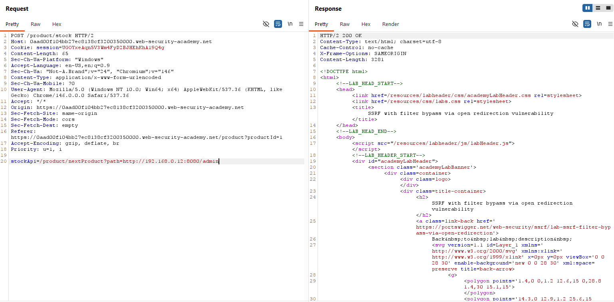

**5. Brisanje carlos-a**

Promenio sam payload u:

```
stockApi=/product/nextProduct?path=http://192.168.0.12:8080/admin/delete?username=carlos
```

Server je izvršio brisanje.

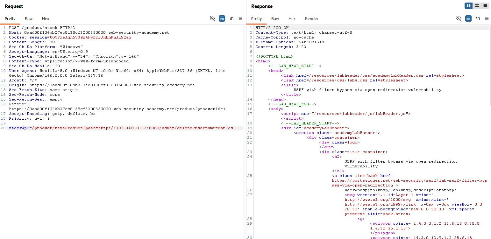

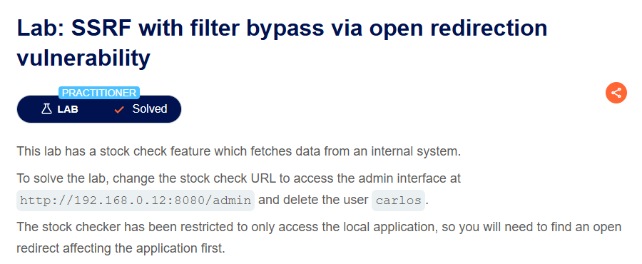

### Zašto je napad uspeo

Aplikacija je imala **dve odvojene ranjivosti** koje su pojedinačno izgledale relativno bezopasno:

- **SSRF sa whitelist filterom** — jaka odbrana sama po sebi
- **Open redirect** — često klasifikovan kao "low severity" u izoliranoj proceni

Njihovim **lančanjem (exploit chaining)** napadač zaobilazi obe odbrane:

- Filter validira destinaciju **pre** nego što HTTP klijent prati redirect-e
- Klijent prati redirect-e bez ponovne validacije

Ovo je razlog zašto je u realnim aplikacijama bitno:

- **Onemogućiti automatsko praćenje redirect-a** u serverskim HTTP klijentima, ili ponovo validirati svaki redirect target istim algoritmom
- **Ne potcenjivati open redirect-e** — sami po sebi su nisko-rizični, ali u kombinaciji sa SSRF-om, CSRF-om, ili OAuth flow-om postaju kritični
- **Validacija u dva koraka:** parse URL → resolve na IP → proveriti da IP nije u privatnim opsezima → koristiti tu istu IP u zahtevu

---

## Lab 5: SSRF with whitelist-based input filter

**Težina:** Practitioner
**Cilj:** Iskoristiti SSRF za pristup `http://localhost/admin` i brisanje `carlos`. Aplikacija ima strict whitelist filter koji dozvoljava samo URL-ove sa hostom `stock.weliketoshop.net`.

> **Napomena:** Originalno je planiran lab "Blind SSRF with out-of-band detection" za peti slot, ali on zahteva Burp Collaborator koji je dostupan samo u Pro verziji Burp Suite-a. Besplatne alternative (interactsh, webhook.site) nisu pouzdano radile u testiranju, pa je umesto njega izabran whitelist filter bypass — konceptualno različita tehnika koja odlično dopunjava blacklist bypass iz Lab 3.

### Koraci rešavanja

**1. Snimanje originalnog zahteva**

Originalni `stockApi` je apsolutni URL ka legitimnom stock servisu:

```
stockApi=http://stock.weliketoshop.net:8080/product/stock/check?productId=1&storeId=1
```

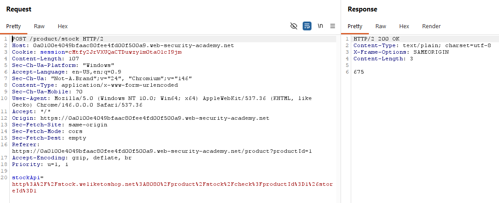

**2. Otkrivanje karaktera filtera**

Naivni napad sa localhost-om:

```
stockApi=http://localhost/admin
```

Vraćeno: `400 "External stock check host must be stock.weliketoshop.net"`. Ovo otkriva dva ključna detalja:

- Filter **eksplicitno proverava host komponentu** URL-a — ne radi tekstualno poređenje sa stringom, već koristi pravi URL parser (verovatno `java.net.URL` ili `URI`)
- Whitelist je strict: dozvoljen je **samo** `stock.weliketoshop.net`

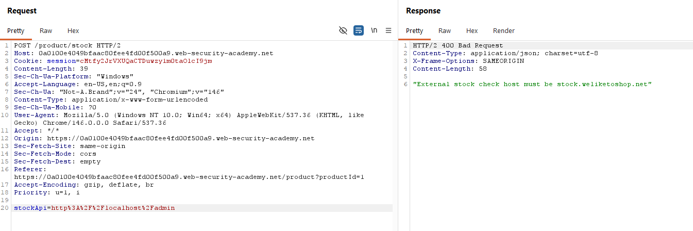

**3. Pokušaj userinfo bypass-a (`@`)**

Klasičan whitelist bypass koristi userinfo komponentu URL-a:

```
stockApi=http://stock.weliketoshop.net@localhost/admin
```

Neki parseri vide `stock.weliketoshop.net` kao "početak URL-a" i propuste validaciju, dok HTTP klijent zna da je sve pre `@` zapravo **userinfo** i pravi host je `localhost`. Međutim, ovo nije uspelo — filter koristi pravi URL parser koji pravilno tumači userinfo, host = `localhost`, payload odbačen.

**4. Iterativno testiranje sa fragmentom (`#`)**

Druga klasična tehnika koristi fragment delimiter:

- **Payload 1:** `http://localhost#@stock.weliketoshop.net/admin` (sirov `#`)
  - Rezultat: `400 blocked`
  - Razlog: parser pravilno tumači — host = `localhost`, sve posle `#` je fragment

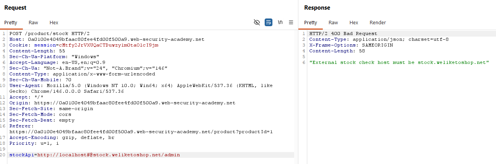

- **Payload 2:** `http://localhost%23@stock.weliketoshop.net/admin` (single-encoded `#`)
  - Rezultat: `400 blocked`
  - Razlog: filter dekodira **jednom** pre validacije, vidi pravu strukturu sa fragmentom, odbacuje

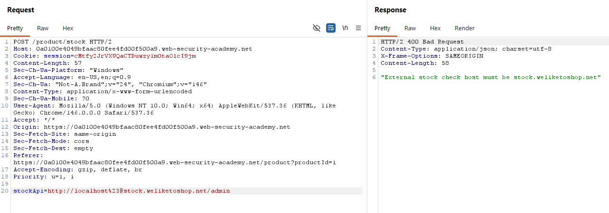

- **Payload 3:** `http://localhost%2523@stock.weliketoshop.net/admin` (double-encoded `#`)
  - Rezultat: `200 OK` sa HTML admin panela ✅

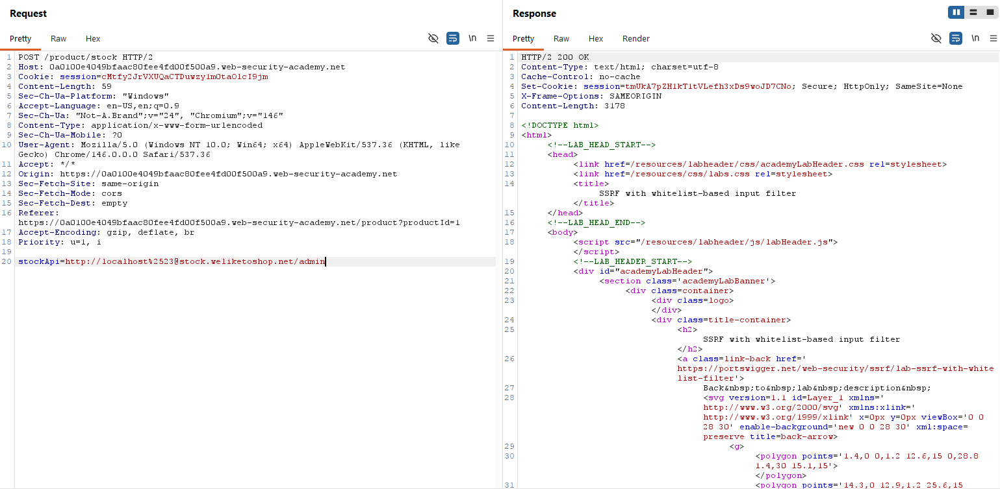

**5. Brisanje carlos-a**

Sa pronađenim bypass-om, finalni payload:

```
stockApi=http://localhost%2523@stock.weliketoshop.net/admin/delete?username=carlos
```

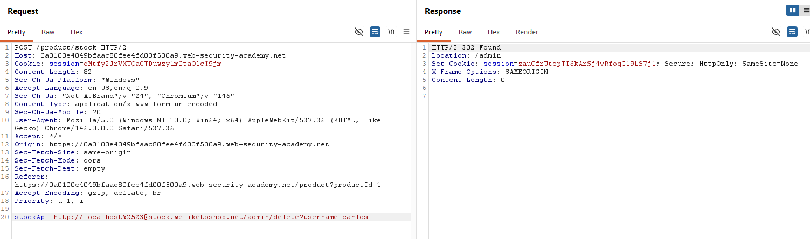

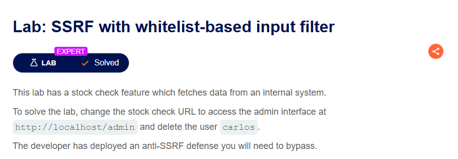

### Zašto je bypass uspeo

Klasičan **TOCTOU (Time-Of-Check-Time-Of-Use)** problem u handling-u URL-ova:

- **Filter dekoduje URL jednom** pre validacije:
  - Ulaz: `localhost%2523@stock.weliketoshop.net/admin`
  - Posle dekodiranja: `localhost%23@stock.weliketoshop.net/admin`
  - U toj formi `%23` **nije razdelnik** (samo sirov `#` jeste razdelnik fragmenta po URL specifikaciji)
  - Parser ceo `localhost%23` tretira kao userinfo, host = `stock.weliketoshop.net` ✅
  - Filter prolazi

- **HTTP klijent dekoduje još jednom** pri pravljenju stvarnog zahteva:
  - Ulaz: `localhost%23@stock.weliketoshop.net/admin`
  - Posle dekodiranja: `localhost#@stock.weliketoshop.net/admin`
  - Sirov `#` je sad razdelnik — host = `localhost`, sve posle `#` se ignoriše kao fragment
  - Server zaista poziva `localhost/admin` ✅

Filter validira **jednu reprezentaciju** URL-a, klijent koristi **drugu** — između validacije i upotrebe URL "promeni značenje". Single-encoded `%23` ne radi jer filter to dekoduje pre provere; double-encoded `%2523` opstaje kroz prvu rundu dekodiranja i otkriva se tek u drugoj rundi koju radi HTTP klijent.

Ovo je fundamentalna ranjivost koja se ne može popraviti samo "boljim filterom" — mora se rešiti **arhitekturalno**:

1. Parsirati URL u standardizovan oblik
2. Resolve-ovati hostname u IP adresu
3. Proveriti da IP nije u privatnim opsezima
4. **Koristiti tu istu IP adresu** za HTTP zahtev (ne ponovo resolve-ovati hostname, što sprečava DNS rebinding)

---