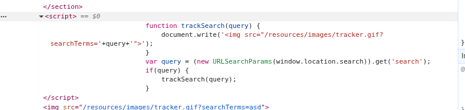
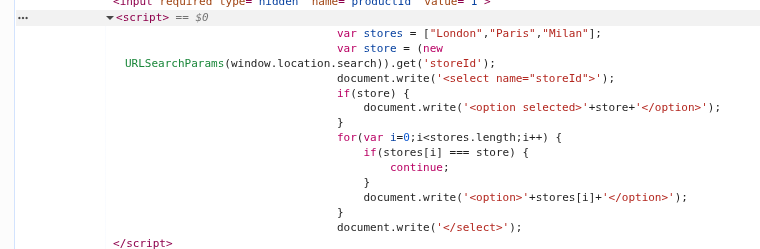
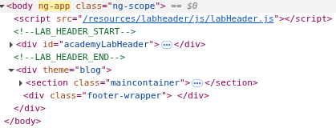
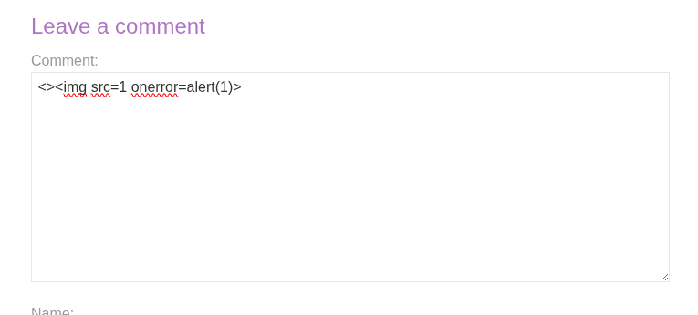
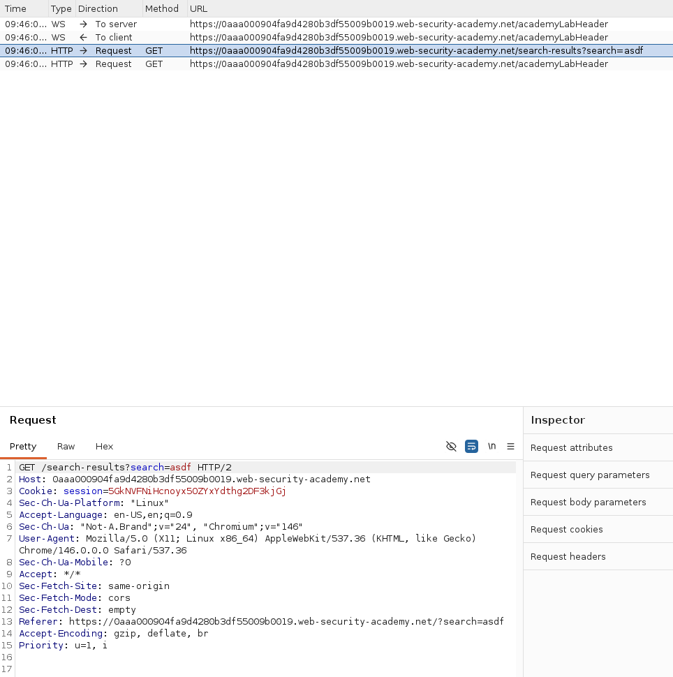
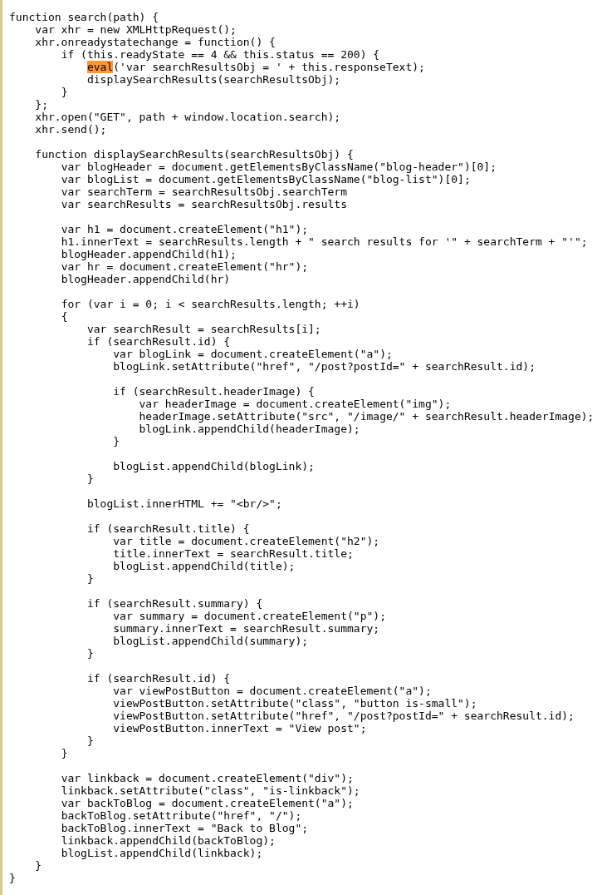

# Skriptovanje između sajtova - Ilija Jordanovski SV 73/2022

Skriptovanje između sajtova (eng. *cross-site scripting*, skr. *XSS*) je kategorija ranjivosti koja napadaču omogućava da kompromituje interakciju korisnika sa ranjivom aplikacijom. Napad funkcioniše tako što se ranjiv veb sajt navede da korisniku vrati maliciozni JavaScript, koji se zatim izvršava u korisnikovom pretraživaču u kontekstu njegove sesije. Na ovaj način napadač zaobilazi *same origin policy* - mehanizam koji sprečava komunikaciju između različitih veb sajtova.

Kao dokaz koncepta, najčešće se koristi `alert()` funkcija jer je kratka, bezopasna i lako uočljiva. U nekim naprednim scenarijima koji koriste *cross-origin iframe*-ove (od Chrome verzije 92), `alert()` ne radi, pa se umesto nje koristi `print()`.

## Vrste XSS napada

- **Reflektovani XSS** (*reflected XSS*) - nastaje kada aplikacija primi podatke iz HTTP zahteva i odmah ih vrati u odgovoru na nesiguran način. Napadač konstruiše maliciozni URL sa skriptom u query parametru, i ako korisnik poseti taj URL, skripta se izvršava u njegovom pretraživaču.
- **Skladišteni XSS** (*stored XSS*, poznat i kao *persistent* ili *second-order XSS*) - nastaje kada aplikacija prima podatke iz nepouzdanog izvora i čuva ih, a zatim ih uključuje u kasnijim HTTP odgovorima na nesiguran način. Primer: komentar na blogu koji sadrži `<script>` tag koji se prikazuje svim korisnicima koji posete stranicu.
- **DOM-bazirani XSS** (*DOM-based XSS*) - nastaje kada aplikacija sadrži klijentski JavaScript koji obrađuje podatke iz nepouzdanog izvora na nesiguran način, najčešće upisivanjem tih podataka nazad u DOM. Ranjivost postoji u klijentskom kodu, za razliku od prethodna dva tipa.

## Uticaj XSS napada

- **Lažno predstavljanje** - napadač može da se predstavlja kao žrtva i izvršava akcije u njeno ime
- **Krađa podataka** - čitanje osetljivih podataka kojima korisnik ima pristup, uključujući kredencijale za prijavu
- **Preuzimanje kontrole nad aplikacijom** - ako kompromitovani korisnik ima administratorska prava, napadač može dobiti punu kontrolu nad aplikacijom i svim njenim korisnicima
- **Defacement** - vizuelno narušavanje izgleda sajta
- **Ubacivanje trojanskog koda** - ubacivanje maliciozne funkcionalnosti u sajt

## Primerene kontramere

- **Enkodiranje podataka na izlazu** - pre nego što se korisnički podaci prikažu u HTTP odgovoru, potrebno ih je enkodirati u skladu sa kontekstom. U HTML kontekstu `<` postaje `&lt;`, a u JavaScript string kontekstu `<` postaje `<`.
- **Validacija ulaza** - na mestu prijema korisničkih podataka, filtrirati ih po beloj listi dozvoljenih vrednosti. Npr. ako se očekuje URL, proveriti da počinje sa `http` ili `https`.
- **Prikladna zaglavlja odgovora** - koristiti `Content-Type` i `X-Content-Type-Options` zaglavlja kako bi se sprečilo da pretraživač pogrešno interpretira sadržaj odgovora.
- **Politika bezbednosti sadržaja** (*Content Security Policy*, skr. *CSP*) - HTTP zaglavlje koje kontroliše koje resurse pretraživač sme da učita i izvrši. Poslednja linija odbrane - čak i ako XSS napad uspe, CSP može ograničiti šta napadač može da uradi.

# Zadaci

## Zadatak 1 - zeleni

### *DOM XSS in document.write sink using source location.search*

Cilj ovog zadatka je izvršiti DOM-baziran XSS napad koji poziva `alert` funkciju kroz funkcionalnost pretrage na sajtu.

Unosom nasumičnog stringa u polje za pretragu i inspekcijom DOM-a primećujemo da se uneta vrednost upisuje direktno unutar `src` atributa `` taga, bez ikakve sanacije. Radi se o `document.write` funkciji koja kao izvor koristi `location.search` - deo URL-a koji korisnik može direktno kontrolisati.



Kako se vrednost umeće unutar navodnika atributa, možemo je "probiti" zatvaranjem navodnika i `src` atributa, pa zatim ubaciti sopstveni HTML tag sa JavaScript payloadom. Pretražuje se sledeci tekst:

```html
"><svg onload=alert(1)>
```

Pretraživač zatvara `src` atribut, a zatim renderuje ubačeni `<svg>` tag čiji `onload` događaj odmah poziva `alert(1)`. Zadatak je rešen.

## Zadatak 2 - plavi

### *DOM XSS in document.write sink using source location.search inside a select element*

Cilj ovog zadatka je izvršiti DOM-baziran XSS napad koji probija `select` element i poziva `alert` funkciju kroz funkcionalnost provere zaliha na stranici proizvoda.

Analizom JavaScript koda na stranici proizvoda uočavamo da se `storeId` parametar iz `location.search` koristi u `document.write` pozivu koji dinamički generiše `<option>` elemente unutar `<select>` padajuće liste. Dodavanjem nasumičnog niza kao vrednosti `storeId` parametra u URL i inspekcijom DOM-a potvrđujemo da se ta vrednost direktno upisuje u `<select>` element bez sanacije.



Kako se vrednost umeće unutar `<select>` taga, možemo "probiti" tu strukturu zatvaranjem `<select>` elementa i ubacivanjem sopstvenog HTML taga sa JavaScript payloadom. Modifikujemo URL-a na sledeći način:

```
product?productId=1&storeId="></select>
```

Pretraživač zatvara `<select>` element, a zatim renderuje ubačeni `` tag čiji `onerror` događaj poziva `alert(1)` jer `src` atribut sadrži nevažeću vrednost. Zadatak je rešen.

## Zadatak 3 - plavi

### *DOM XSS in AngularJS expression with angle brackets and double quotes HTML-encoded*

Cilj ovog zadatka je izvršiti DOM-baziran XSS napad kroz AngularJS izraz u funkcionalnosti pretrage, u uslovima kada su uglaste zagrade i navodnici HTML-enkodirani.

Unosom nasumičnog niza u polje za pretragu i pregledom izvornog koda stranice primećujemo da se uneta vrednost nalazi unutar HTML elementa koji sadrži `ng-app` direktivu. Ovo znači da AngularJS obrađuje sadržaj tog elementa i da se JavaScript izrazi unutar dvostrukih vitičastih zagrada `{{ }}` evaluiraju. Pošto su uglaste zagrade i navodnici enkodirani, klasičan XSS payload sa `<script>` tagom ili HTML atributima neće raditi.



Umesto toga, možemo iskoristiti sam AngularJS za izvršavanje proizvoljnog JavaScripta. Pristupamo `$on.constructor` koji vraća referencu na `Function` konstruktor, što nam omogućava da kreiramo i odmah pozovemo novu funkciju sa proizvoljnim kodom. Unosi se sledeći izraz u polje za pretragu:

```
{{$on.constructor('alert(1)')()}}
```

AngularJS evaluira izraz, kreira novu funkciju sa telom `alert(1)` i odmah je poziva. Zadatak je rešen.

## Zadatak 4 - plavi

### *Stored DOM XSS*

Cilj ovog zadatka je iskoristiti skladištenu DOM XSS ranjivost u funkcionalnosti komentara na blogu kako bi se pozvala `alert` funkcija.

Sajt pokušava da spreči XSS enkodiranjem uglastih zagrada koristeći JavaScript `replace()` funkciju. Međutim, kada se `replace()` poziva sa string argumentom umesto regularnog izraza, zamenjuje samo **prvo** pojavljivanje traženog niza. Ovo možemo iskoristiti tako što na početak payloada dodamo "lažni" par uglastih zagrada koji će biti enkodiran umesto onih iz stvarnog payloada, čime svaki naredni par ostaje netaknut i biva renderovan kao HTML.

Postavlja se sledeći komentar:

```
<>
```



`replace()` enkodira prvi `<>`, dok uglaste zagrade u `` tagu prolaze nesmetano. Pretraživač renderuje `` tag čiji `onerror` događaj poziva `alert(1)` zbog nevažeće vrednosti `src` atributa. Zadatak je rešen.

## Zadatak 5 - plavi

### *Reflected DOM XSS*

Cilj ovog zadatka je iskoristiti reflektovanu DOM XSS ranjivost kroz funkcionalnost pretrage, gde server obrađuje upit i vraća ga u JSON odgovoru koji se zatim obrađuje na klijentskoj strani.

Pretraživanjem u Burp Suiteu uočavamo da server vraća rezultate pretrage kao JSON odgovor kroz `search-results` endpoint. Analizom `searchResults.js` datoteke primećujemo da se taj JSON odgovor prosleđuje direktno u `eval()` poziv.



`eval()` je JavaScript funkcija koja prima string i izvršava ga kao kod. Ako napadač može da kontroliše sadržaj stringa koji se prosleđuje `eval()`-u, može ubaciti JavaScript kod koji će biti izvršen.

Eksperimentisanjem sa različitim vrednostima pretrage utvrđujemo da server enkodira navodnike (`"` → `\"`), ali ne enkodira kose crte unazad (`\`). Ovo možemo iskoristiti: slanjem `\"` server enkodira navodnik u `\"`, ali naša kosa crta unazad ostaje, čime u JSON-u dobijamo `\\"` - što JSON parser tumači kao literalni karakter `\` nakon kojeg sledi `"` koji **zatvara** string. Na taj način "probijamo" JSON string i ostatak payloada se izvršava kao kod unutar `eval()`-a.

```
\"-alert(1)}//
```



`//` na kraju komentariše ostatak JSON-a koji bi inače prouzrokovao grešku parsiranja. Zadatak je rešen.
